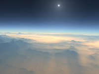
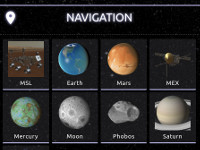
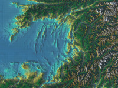
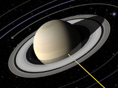

<p align="center"> 
  
</p>

CosmoScout VR is a modular virtual universe which lets you explore, analyze and present huge planetary datasets and large simulation data in real-time.

[](LICENSE)

[](cloc.sh)
[](cloc.sh)
[](cloc.sh)
[](https://gitter.im/cosmoscout/community)

CosmoScout uses C++17 and OpenGL. It can be build on Linux (GCC) and Windows (MSVC). Nearly all dependencies are included as [git submodules](externals), please refer to the section [Build Instructions](#build-instructions) in order to get started.

We try to add as many comments to the source code as possible. The number of source code lines and comment lines above is computed with the script [cloc.sh](cloc.sh). This script only counts *real comments*. Any dumb comments (such as copy-right headers or stuff like `/////////`) are not included in this number.

# Features

**CosmoScout VR is research software which is still under heavy development and changes on a daily basis. Many features are badly documented, it will crash without warning and may do other unexpected things. We are working hard on improving the user experience - please [report all issues and suggestions](https://github.com/cosmoscout/cosmoscout-vr/issues) you have!**

Below is a rough sketch of the possibilities you have with CosmoScout VR. While this list is far from complete it provides a good overview of the current feature set.

- [ ] Solar System Simulation
  - [X] Positioning of celestial bodies and space crafts based on [SPICE](https://naif.jpl.nasa.gov/naif)
  - [X] Rendering of highly detailed level-of-detail planets based on WebMapServices (with [csp-lod-bodies](https://github.com/cosmoscout/csp-lod-bodies))
  - [X] Rendering of configurable atmospheres (Mie- and Rayleigh-scattering) around planets (with [csp-atmospheres](https://github.com/cosmoscout/csp-atmospheres))
  - [X] Physically based rendering of 3D satellites (with [csp-satellites](https://github.com/cosmoscout/csp-satellites))
  - [X] Rendering of Tycho, Tycho2 and Hipparcos star catalogues (with [csp-stars](https://github.com/cosmoscout/csp-stars))
  - [X] Rendering of orbits and trajectories based on SPICE (with [csp-trajectories](https://github.com/cosmoscout/csp-trajectories))
  - [ ] Rendering of shadows
  - [ ] HDR-Rendering
- [ ] Flexible User Interface
  - [X] Completely written in JavaScript with help of the [Chromium Embedded Framework](https://bitbucket.org/chromiumembedded/cef/src)
  - [X] Main UI be drawn in screen- or world-space
  - [X] Web pages can be placed on planetary surfaces
  - [X] Interaction works both, in VR and on Desktop
  - [ ] Clear API between C++ and JavaScript 
- [ ] Cross-Platform
  - [X] Runs on Linux
  - [X] Runs on Windows
  - [ ] Runs on MacOS
- [ ] System Architecture
  - [X] Plugin-based - most functionality is loaded at run-time
  - [ ] Network synchronization of multiple instances
- [ ] Hardware device support - CosmoScout VR basically supports everything which is supported by [ViSTA](https://github.com/cosmoscout/vista) and [VRPN](https://github.com/vrpn/vrpn). The devices below are actively supported (or planned to be supported).
  - [X] Mouse
  - [X] Keyboard
  - [X] HTC-Vive
  - [X] ART-Tracking systems
  - [X] 3D-Connexion Space Navigator
  - [X] Multi-screen systems like tiled displays or CAVE's
  - [X] Multi-screen systems on distributed rendering clusters
  - [X] Side-by-side stereo systems
  - [X] Quad-buffer stereo systems
  - [X] Anaglyph stereo systems
  - [ ] Game Pads like the X-Box controller

## Plugins for CosmoScout VR

CosmoScout VR can be extended via plugins. In fact, without any plugins, CosmoScout VR is just a black and empty universe. Here is a list of available plugins.

Official Plugins | Description | Screenshot
:----|:-----------------|:----------
[csp-anchor-labels](https://github.com/cosmoscout/csp-anchor-labels) | Draws a click-able label at each celestial anchor. When activated, the user automatically travels to the according body. The size and overlapping-behavior of the labels can be adjusted. | 
[csp-atmospheres](https://github.com/cosmoscout/csp-atmospheres) | Draws atmospheres around celestial bodies. It calculates single Mie- and Rayleigh scattering via raycasting in real-time. | 
[csp-fly-to-locations](https://github.com/cosmoscout/csp-fly-to-locations) | Adds several quick travel targets to the sidebar. It supports shortcuts to celestial bodies and to specific geographic locations on those bodies. | 
[csp-lod-bodies](https://github.com/cosmoscout/csp-lod-bodies) | Draws level-of-detail planets and moons. This plugin supports the visualization of entire planets in a 1:1 scale. The data is streamed via Web-Map-Services (WMS) over the internet. A dedicated MapServer is required to use this plugin. | 
[csp-measurement-tools](https://github.com/cosmoscout/csp-measurement-tools) | Provides several tools for terrain measurements. For example, it supports the measurement of distances, height profiles, volumes or areas. | 
[csp-rings](https://github.com/cosmoscout/csp-rings) |  Draws simple rings around celestial bodies. The rings can be configured with a inner and a outer radius and a texture. | 
[csp-satellites](https://github.com/cosmoscout/csp-satellites) | Draws GTLF models at positions based on SPICE data. It uses physically based rendering for surface shading. | 
[csp-sharad](https://github.com/cosmoscout/csp-sharad) | Renders radar datasets acquired by the Mars Reconnaissance Orbiter. The SHARAD profiles are rendered inside of Mars, the Martian surface is made translucent in front of the profiles. | 
[csp-simple-bodies](https://github.com/cosmoscout/csp-simple-bodies) | Renders simple spherical celestial bodies. The bodies are drawn as an ellipsoid with an equirectangular texture. | 
[csp-stars](https://github.com/cosmoscout/csp-stars) | Draws 3D-stars loaded from catalogues. For now, it supports the Tycho, the Tycho2 and the Hipparcos catalogue. | 
[csp-trajectories](https://github.com/cosmoscout/csp-trajectories) | Draws trajectories of celestial bodies and spacecrafts based on SPICE. The color, length, number of samples and reference frame can be configured. | 

# Getting Started

We are happy to receive contributions to CosmoScout VR in the form of **merge requests** via Github. Feel free to fork the repository, implement your changes and create a merge request to the `develop` branch.

Further information on how to contribute can be found in [CONTRIBUTING.md](CONTRIBUTING.md).

## Build Instructions

This software can be build in debug and release mode on Linux and Windows. Below you find the generic build instructions. Most dependencies are included as [git submodules](externals). You will only need a copy of [CMake](https://cmake.org/) (version 3.12 or greater), [Boost](https://www.boost.org/) (version 1.69 or greater) and a recent C++ compiler (GCC 8 or MSVC 19). For the compilation of the externals [Python](https://www.python.org/) is also required.

### Linux

On Linux, one can either use the provided shell scripts ([make_release.sh](make_release.sh) and [make_debug.sh](make_debug.sh)) or build the software manually using CMake. **Using the provided scripts** is easy and definitely the recommended way.

In any way, first you have to compile the dependencies. This step only has to be done once.

```shell
mkdir cosmoscout
cd cosmoscout
git clone git@github.com:cosmoscout/cosmoscout-vr.git src
cd src
git submodule update --init
cd ..
src/make_externals.sh
```

This will clone the repository to `cosmoscout/src` configure and build all externals in `cosmoscout/build/linux-externals` and will install them to `cosmoscout/install/linux-externals`. You can delete the directories in `cosmoscout/build` and `cosmoscout/install` at any time in order to force a reconfiguration or re-installation. Now you can compile CosmoScout VR:

```shell
src/make_release.sh
```

This will configure and build CosmoScout VR in `cosmoscout/build/linux-release` and will install it to `cosmoscout/install/linux-release`. You can delete the directories in `cosmoscout/build` and `cosmoscout/install` at any time in order to force a reconfiguration or re-installation. The application can be executed with:

```shell
cd install/linux-release/bin
./start.sh
```

For **manual compilation** follow the steps outlined in [make_release.sh](make_release.sh) or [make_debug.sh](make_debug.sh).

### Windows

For Windows, there are batch scripts ([make_release.bat](make_release.bat) and [make_debug.bat](make_debug.bat)) which can be used in the same way as the scripts for Linux:

First you have to compile the dependencies. This step only has to be done once. Run the commands below from the Visual Studio Developer Command Line:

```batch
mkdir cosmoscout
cd cosmoscout
git clone git@github.com:cosmoscout/cosmoscout-vr.git src
cd src
git submodule update --init
cd ..
src\make_externals.bat
```

This will clone the repository to `cosmoscout\src` configure and build all externals in `cosmoscout\build\windows-externals` and will install them to `cosmoscout\install\windows-externals`. You can delete the directories in `cosmoscout\build` and `cosmoscout\install` at any time in order to force a reconfiguration or re-installation. Now you can compile CosmoScout VR:

```batch
src\make_release.bat
```

This will configure and build CosmoScout VR in `cosmoscout\build\windows-release` and will install it to `cosmoscout\install\windows-release`. You can delete the directories in `cosmoscout\build` and `cosmoscout\install` at any time in order to force a reconfiguration or re-installation. The application can be executed with:

```batch
cd install\windows-release\bin
start.bat
```

## Using the application

There is a more in-depth tutorial available in [the doc folder](doc/intro.html). Once cloned, open this file in your web-browser to get started!


# Complete List of Dependencies

The list below contains all dependencies of CosmoScout VR. Besides Boost, all of them are included either as [git submodules](externals) or directly in the source tree. Some of the dependencies are only required by some plugins.

| Engine Dependencies | Description | License |
|:---|:---|:---|
| [Boost (chrono, filesystem, date_time)](http://www.boost.org) | Used for time conversions and file system operations. | [Boost Software License](http://www.boost.org/LICENSE_1_0.txt) |
| [c-ares](https://c-ares.haxx.se) | A dependency of curl, used for asynchronous DNS requests. | [MIT](https://c-ares.haxx.se/license.html) |
| [Chromium Embedded Framework](https://bitbucket.org/chromiumembedded/cef) | For the Webkit based user interface. | [BSD](https://bitbucket.org/chromiumembedded/cef/raw/a5a5e7ff08129f4122437dfdbba93d2a746c5c59/LICENSE.txt) |
| [Curl](https://curl.haxx.se) | Library for downloading stuff from the Internet. | [MIT style](https://curl.haxx.se/legal/licmix.html) |
| [CurlPP](https://github.com/jpbarrette/curlpp) | C++ wrapper for curl. | [MIT style](https://github.com/jpbarrette/curlpp/blob/master/doc/LICENSE) |
| [FreeGlut](https://sourceforge.net/p/freeglut) | Windowing toolkit dependency of OpenSG. | [MIT](https://sourceforge.net/p/freeglut/code/HEAD/tree/trunk/freeglut/freeglut/COPYING) |
| [glew](http://glew.sourceforge.net) | OpenGL extension wrangler. | [Modified BSD](http://glew.sourceforge.net/glew.txt) |
| [glm](https://glm.g-truc.net) | Math library used throughout CosmoScout. | [Happy Bunny / MIT](https://glm.g-truc.net/copying.txt) |
| [JsonHPP](https://github.com/nlohmann/json) | Parses json files in C++. | [MIT](https://github.com/nlohmann/json/blob/develop/LICENSE.MIT) |
| [LibTiff](http://www.libtiff.org) | For .tiff image format support. | [BSD-like](http://www.libtiff.org/misc.html) |
| [OpenSG](https://sourceforge.net/p/opensg) | Scenegraph used as backend by Vista. | [LGPL](https://sourceforge.net/p/opensg/code/ci/master/tree/COPYING) |
| [OpenVR](https://github.com/ValveSoftware/openvr) | Adds support for the HTC-Vive. | [BSD 3-Clause](https://github.com/ValveSoftware/openvr/blob/master/LICENSE) |
| [SPICE](https://naif.jpl.nasa.gov/naif) | Library to compute positions of celestial objects. | [Custom License](https://naif.jpl.nasa.gov/naif/rules.html) |
| [STBImage](https://github.com/nothings/stb) | Library for loading .jpg and .png files. | [Public Domain](https://github.com/nothings/stb/blob/master/docs/why_public_domain.md) |
| [Vista](https://sourceforge.net/projects/vistavrtoolkit/) | VR-Framework for scenegraphs, distributed rendering and low-level VR-device access. | [LGPL](https://sourceforge.net/projects/vistavrtoolkit/) |
| [VRPN](https://github.com/vrpn/vrpn) | Used for supporting various hardware devices. | [Boost Software License](https://github.com/vrpn/vrpn/wiki/License) |
| [zlib](https://zlib.net) | Dependency of Vista. | [MIT style](https://zlib.net/zlib_license.html) |
| **UI Dependencies** | **Description** | **License** |
| [Alegreya Sans Font](https://fonts.google.com/specimen/Alegreya+Sans) | This font is used for the CosmoScout VR logo. | [Open Font License ](https://fonts.google.com/specimen/Alegreya+Sans) |
| [Bootstrap Date Picker](https://github.com/uxsolutions/bootstrap-datepicker) | The calendar in the user interface. | [Apache License 2.0](https://github.com/uxsolutions/bootstrap-datepicker/blob/master/LICENSE) |
| [D3.js](https://github.com/d3/d3) | Used for some tools (like path measurement) to draw graphs in the user interface. | [BSD 3-Clause](https://github.com/d3/d3/blob/master/LICENSE) |
| [fuzzyset.js](https://github.com/Glench/fuzzyset.js) | Used for the location search on other planets and moons. | [BSD](https://github.com/Glench/fuzzyset.js) |
| [jQuery](https://jquery.org) | JavaScript library which is used extensively in the user interface. | [MIT](https://jquery.org/license/) |
| [Material Icons](https://github.com/google/material-design-icons) | Icon set uses in the user interface. | [Apache License 2.0](https://github.com/google/material-design-icons/blob/master/LICENSE) |
| [MaterializeCSS](https://github.com/Dogfalo/materialize) | CSS-toolkit used in the user interface. | [MIT](https://github.com/Dogfalo/materialize/blob/master/LICENSE) |
| [noUiSlider](https://refreshless.com/nouislider) | JavaScript library for advanced sliders. | [WTFPL](http://www.wtfpl.net/about/) |
| [Ubuntu Font](https://design.ubuntu.com/font) | This font is used in the user interface of CosmoScout VR. | [Ubuntu font licence](https://www.ubuntu.com/legal/terms-and-policies/font-licence) |
| **Runtime Dependencies** | **Description** | **License** |
| [Apache built by Apachehaus](https://www.apachehaus.com/cgi-bin/download.plx) | This is a pre-compiled apache server for windows which can be used to run your own Mapserver. Only required by the `csp-lod-bodies` plugin. | [Apache License 2.0](https://www.apache.org/licenses/) |
| [GDAL](https://trac.osgeo.org/gdal) | Dependency of the Mapserver. Only required by the `csp-lod-bodies` plugin. | [X11/MIT](https://trac.osgeo.org/gdal/wiki/FAQGeneral#WhatlicensedoesGDALOGRuse) |
| [Mapserver](http://mapserver.org) | Used to provide map data over the internat. Only required by the `csp-lod-bodies` plugin. | [MIT](http://mapserver.org/copyright.html) |
| [proj.4](https://proj.org) | The `csp-lod-bodies` requires a [special version](https://github.com/cosmoscout/proj.4) of this library to be used by the Mapserver. | [MIT](https://proj.org/about.html) |

# MIT License

Copyright (c) 2019 German Aerospace Center (DLR)

Permission is hereby granted, free of charge, to any person obtaining a copy
of this software and associated documentation files (the "Software"), to deal
in the Software without restriction, including without limitation the rights
to use, copy, modify, merge, publish, distribute, sublicense, and/or sell
copies of the Software, and to permit persons to whom the Software is
furnished to do so, subject to the following conditions:

The above copyright notice and this permission notice shall be included in all
copies or substantial portions of the Software.

THE SOFTWARE IS PROVIDED "AS IS", WITHOUT WARRANTY OF ANY KIND, EXPRESS OR
IMPLIED, INCLUDING BUT NOT LIMITED TO THE WARRANTIES OF MERCHANTABILITY,
FITNESS FOR A PARTICULAR PURPOSE AND NONINFRINGEMENT. IN NO EVENT SHALL THE
AUTHORS OR COPYRIGHT HOLDERS BE LIABLE FOR ANY CLAIM, DAMAGES OR OTHER
LIABILITY, WHETHER IN AN ACTION OF CONTRACT, TORT OR OTHERWISE, ARISING FROM,
OUT OF OR IN CONNECTION WITH THE SOFTWARE OR THE USE OR OTHER DEALINGS IN THE
SOFTWARE.
