
 
  

CosmoScout VR is a modular virtual universe developed at the German Aerospace Center (DLR).
It lets you explore, analyze and present huge planetary data sets and large simulation data in real-time.

The software can be build on Linux (gcc or clang) and Windows (msvc).
Nearly all dependencies are included as [git submodules](externals), please refer to the [**documentation**](docs) in order to get started.

# Features

 
  

Below is a rough sketch of the possibilities you have with CosmoScout VR.
While this list is far from complete it provides a good overview of the current feature set.
You can also read the [**changelog**](docs/changelog.md) to learn what's new in the current version. There is also an [**interesting article in the DLR magazine**](https://dlr.de/dlr/portaldata/1/resources/documents/dlr_magazin_161_EN/DLR-Magazin_161-GB/?page=18) which provides some insight into the ideas behind CosmoScout VR. 

- [ ] Solar System Simulation
  - [X] Positioning of celestial bodies and space crafts based on [SPICE](https://naif.jpl.nasa.gov/naif)
  - [X] Rendering of highly detailed level-of-detail planets based on WebMapServices (with [csp-lod-bodies](https://github.com/cosmoscout/csp-lod-bodies))
  - [X] Rendering of configurable atmospheres (Mie- and Rayleigh-scattering) around planets (with [csp-atmospheres](https://github.com/cosmoscout/csp-atmospheres))
  - [X] Physically based rendering of 3D satellites (with [csp-satellites](https://github.com/cosmoscout/csp-satellites))
  - [X] Rendering of Tycho, Tycho2 and Hipparcos star catalogues (with [csp-stars](https://github.com/cosmoscout/csp-stars))
  - [X] Rendering of orbits and trajectories based on SPICE (with [csp-trajectories](https://github.com/cosmoscout/csp-trajectories))
  - [ ] Rendering of shadows
  - [ ] HDR-Rendering
- [ ] Flexible User Interface
  - [X] Completely written in JavaScript with help of the [Chromium Embedded Framework](https://bitbucket.org/chromiumembedded/cef/src)
  - [X] Main UI can be drawn in the screen- or world-space
  - [X] Web pages can be placed on planetary surfaces
  - [X] Interaction works both in VR and on the Desktop
  - [ ] Clear API between C++ and JavaScript 
- [ ] Cross-Platform
  - [X] Runs on Linux
  - [X] Runs on Windows
  - [ ] Runs on MacOS
- [ ] System Architecture
  - [X] Plugin-based - most functionality is loaded at run-time
  - [ ] Network synchronization of multiple instances
- [ ] Hardware device support - CosmoScout VR basically supports everything which is supported by [ViSTA](https://github.com/cosmoscout/vista) and [VRPN](https://github.com/vrpn/vrpn). The devices below are actively supported (or planned to be supported).
  - [X] Mouse
  - [X] Keyboard
  - [X] HTC-Vive
  - [X] ART-Tracking systems
  - [X] 3D-Connexion Space Navigator
  - [X] Multi-screen systems like tiled displays or CAVE's
  - [X] Multi-screen systems on distributed rendering clusters
  - [X] Side-by-side stereo systems
  - [X] Quad-buffer stereo systems
  - [X] Anaglyph stereo systems
  - [ ] Game Pads like the X-Box controller

# Getting Started

 
  

:warning: _**Warning:** CosmoScout VR is research software which is still under heavy development and changes on a daily basis.
Many features are badly documented, it will crash without warning and may do other unexpected things.
We are working hard on improving the user experience - please [report all issues and suggestions](https://github.com/cosmoscout/cosmoscout-vr/issues) you have!_

For each release, [binary packages](https://github.com/cosmoscout/cosmoscout-vr/releases) are automatically created via [Github Actions](https://github.com/cosmoscout/cosmoscout-vr/actions).

When started for the very first time, some example datasets will be downloaded from the internet.
**This will take some time!**
The progress of this operation is shown on the loading screen.

If the binary releases do not work for you or you want to test the latest features, you have to compile CosmoScout VR yourself.
This is actually quite easy as there are several guides in the **[`docs`](docs)** directory to get you started!

# Plugins for CosmoScout VR

CosmoScout VR can be extended via plugins.
In fact, without any plugins, CosmoScout VR is just a black and empty universe. Here is a list of available plugins.

Official Plugins | Description | Screenshot
:----|:-----------------|:----------
[csp-anchor-labels](https://github.com/cosmoscout/csp-anchor-labels) | Draws a click-able label at each celestial anchor. When activated, the user automatically travels to the selected body. The size and overlapping-behavior of the labels can be adjusted. | 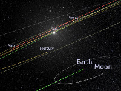
[csp-atmospheres](https://github.com/cosmoscout/csp-atmospheres) | Draws atmospheres around celestial bodies. It calculates single Mie- and Rayleigh scattering via raycasting in real-time. | 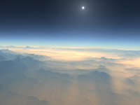
[csp-fly-to-locations](https://github.com/cosmoscout/csp-fly-to-locations) | Adds several quick travel targets to the sidebar. It supports shortcuts to celestial bodies and to specific geographic locations on those bodies. | 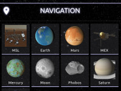
[csp-lod-bodies](https://github.com/cosmoscout/csp-lod-bodies) | Draws level-of-detail planets and moons. This plugin supports the visualization of entire planets in a 1:1 scale. The data is streamed via Web-Map-Services (WMS) over the internet. A dedicated MapServer is required to use this plugin. | 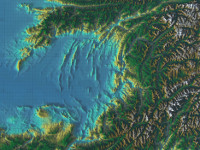
[csp-measurement-tools](https://github.com/cosmoscout/csp-measurement-tools) | Provides several tools for terrain measurements. Like measurement of distances, height profiles, volumes or areas. | 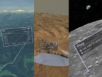
[csp-rings](https://github.com/cosmoscout/csp-rings) |  Draws simple rings around celestial bodies. The rings can be configured with an inner and an outer radius and a texture. | 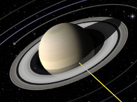
[csp-satellites](https://github.com/cosmoscout/csp-satellites) | Draws GTLF models at positions based on SPICE data. It uses physically based rendering for surface shading. | 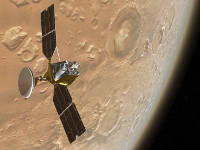
[csp-sharad](https://github.com/cosmoscout/csp-sharad) | Renders radar datasets acquired by the Mars Reconnaissance Orbiter. The SHARAD profiles are rendered inside of Mars, the Martian surface is made translucent in front of the profiles. | 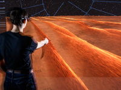
[csp-simple-bodies](https://github.com/cosmoscout/csp-simple-bodies) | Renders simple spherical celestial bodies. The bodies are drawn as an ellipsoid with an equirectangular texture. | 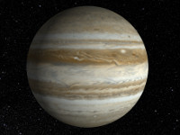
[csp-stars](https://github.com/cosmoscout/csp-stars) | Draws 3D-stars loaded from catalogues. For now Tycho, Tycho2 and the Hipparcos catalogue are supported. | 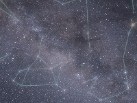
[csp-trajectories](https://github.com/cosmoscout/csp-trajectories) | Draws trajectories of celestial bodies and spacecrafts based on SPICE. The color, length, number of samples and the reference frame can be configured. | 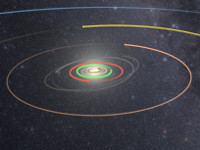

# License

Copyright (c) 2019 German Aerospace Center (DLR)

Permission is hereby granted, free of charge, to any person obtaining a copy
of this software and associated documentation files (the "Software"), to deal
in the Software without restriction, including without limitation the rights
to use, copy, modify, merge, publish, distribute, sublicense, and/or sell
copies of the Software, and to permit persons to whom the Software is
furnished to do so, subject to the following conditions:

The above copyright notice and this permission notice shall be included in all
copies or substantial portions of the Software.

THE SOFTWARE IS PROVIDED "AS IS", WITHOUT WARRANTY OF ANY KIND, EXPRESS OR
IMPLIED, INCLUDING BUT NOT LIMITED TO THE WARRANTIES OF MERCHANTABILITY,
FITNESS FOR A PARTICULAR PURPOSE AND NONINFRINGEMENT. IN NO EVENT SHALL THE
AUTHORS OR COPYRIGHT HOLDERS BE LIABLE FOR ANY CLAIM, DAMAGES OR OTHER
LIABILITY, WHETHER IN AN ACTION OF CONTRACT, TORT OR OTHERWISE, ARISING FROM,
OUT OF OR IN CONNECTION WITH THE SOFTWARE OR THE USE OR OTHER DEALINGS IN THE
SOFTWARE.

### Credits

Some badges in this README.md are from [shields.io](https://shields.io). The documentation of CosmoScout VR also uses icons from [simpleicons.org](https://simpleicons.org/).

