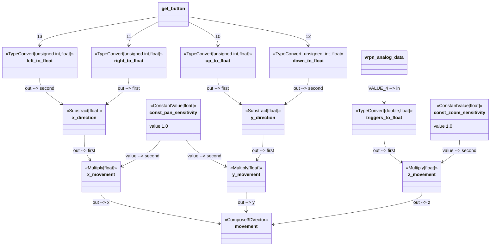

## Controller Input

---
## Triggers & D-Pad to movement (panning & zooming)

---
## Right Stick & Shoulder Buttons to rotation (pitch, yaw, roll)

---
## navigation to observer

---
## Buttons to Mouse Buttons

---
## Left stick to mouse movement

---
## limit mouse position to viewport bounds

---
## Set initial values for mouse X-Pos & Y-Pos

