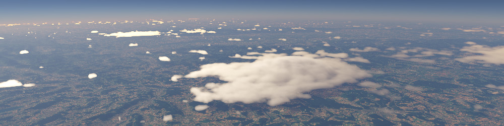
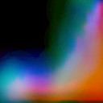
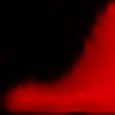
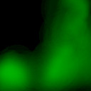
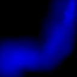

<!-- 
SPDX-FileCopyrightText: German Aerospace Center (DLR) <cosmoscout@dlr.de>
SPDX-License-Identifier: CC-BY-4.0
 -->

 
  

# Advanced Cloud model

The advanced cloud model is a new addition to the atmospheres plug-in drawing heavy inspiration from Andrew Schneider's talks about the Nubis cloud model in Decima Engine. There is one new type of texture that has to be provided in the config file, `cloudTypeTexture`.

  
  
  
  

The texture is sampled depending on cloud type (U) and height in the cloud layer (V). The cloud type by default is calculated from the conventional cloud texture (+ some 2D noise and scaling), but you could also easily modify the shader code to read the cloud type directly from some texture.

The channels of the texture represent
1. The base density of the cloud. Unlike in Andrew Schneider's work, a single texture has to suffice for this because the cloud bottoms aren't as relevant for this system's main use case, generating views from space. In the shader code, the cloud type is remapped so that all values greater than `CLOUD_COVER_MAX` get assigned the maximum cloud type. This helps produce nice clean cloud tops for very large cloud formations.
2. Influence strength of low-frequency noises.
3. High-frequency noise influence. Keep this low for cloud bottoms.

All channels can be fine-tuned for specific scenarios. Currently the system is configured for large scale cloud scapes seen from space by default.

All noises are subject to a LOD system so that high-frequency noises are only sampled when they need to be. If you are changing the noise blending, you might also consider changing the LOD interval constants.

## References
### talks by Andrew Schneider at the SIGGRAPH advances in real-time rendering workshop
[2015](https://advances.realtimerendering.com/s2015/The%20Real-time%20Volumetric%20Cloudscapes%20of%20Horizon%20-%20Zero%20Dawn%20-%20ARTR.pdf)

[2017](https://advances.realtimerendering.com/s2017/Nubis%20-%20Authoring%20Realtime%20Volumetric%20Cloudscapes%20with%20the%20Decima%20Engine%20-%20Final%20.pdf)

[2022](https://advances.realtimerendering.com/s2022/SIGGRAPH2022-Advances-NubisEvolved-NoVideos.pdf)

[2023](https://advances.realtimerendering.com/s2023/Nubis%20Cubed%20(Advances%202023).pdf)

### Phase function used

Jendersie, Johannes, and Eugene d'Eon. "An Approximate Mie Scattering Function for Fog and Cloud Rendering." ACM SIGGRAPH 2023 Talks. 2023. 1-2.