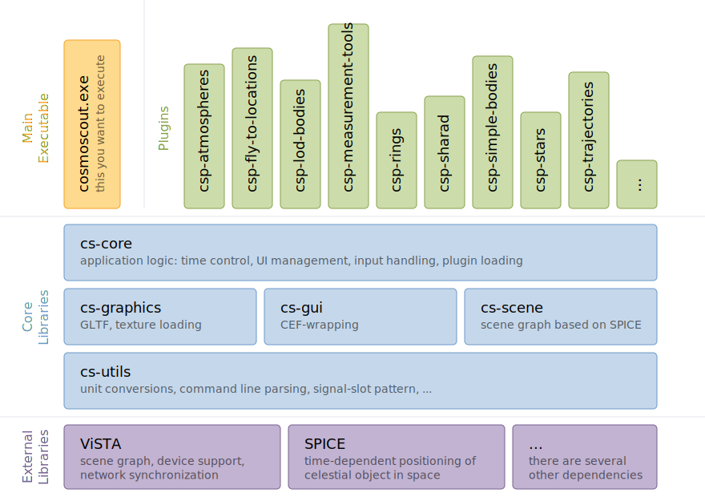

 
  

# Architecture of CosmoScout VR

The high-level architecture of CosmoScout VR is shown in the diagram below.
More fine-grained information on the architecture of specific plugins will be available in the repositories of the [individual plugins](../README.md#Plugins-for-CosmoScout-VR).

 
  

As a user, you will get in touch with the `cosmoscout` executable and the individual plugin libraries. While the plugins may link to some special-purpose third-party libraries, all of them link against the CosmoScout VR core libraries.

There are five core libraries: [`cs-core`](../src/cs-core) contains all the application logic and links against [`cs-graphics`](../src/cs-graphics), [`cs-gui`](../src/cs-gui) and [`cs-scene`](../src/cs-scene).
All of them use some utility functionality from [`cs-utils`](../src/cs-utils).

CosmoScout VR uses [several third-party libraries](dependencies.md) as a basis.
The most important ones are [ViSTA](https://github.com/cosmoscout/vista) (which itself requires [OpenSG 1.8](https://github.com/cosmoscout/opensg-1.8)) and [SPICE](https://naif.jpl.nasa.gov/naif/toolkit.html).

  <a href="citation.md"> &lsaquo; How to cite CosmoScout VR</a>
  
  <a href="README.md">&#8962; Help Index</a>
  
  <a href="dependencies.md">Dependencies &rsaquo;</a>

