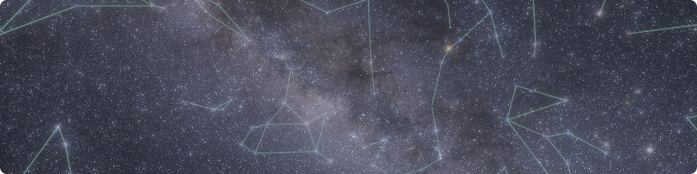

 
  

# How to cite CosmoScout VR

If you use CosmoScout VR in your scientific work, please use the DOI of the version you are currently using.
The DOI of each release is shown on the [releases page](https://github.com/cosmoscout/cosmoscout-vr/releases).
With the link below you can export a citation in many different formats.

  <a href="migration.md"> &lsaquo; Migration Guide</a>
  
  <a href="README.md">&#8962; Help Index</a>
  
  <a href="release-management.md">Release Management &rsaquo;</a>

