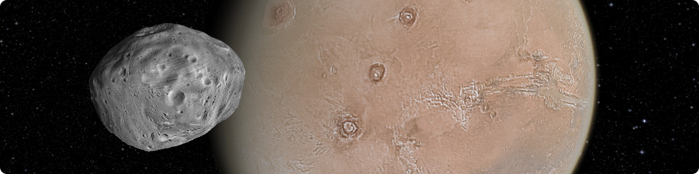

<p align="center">
  
</p>

# Configuring CosmoScout VR

When you launch CosmoScout VR via the start scripts ([`start.sh`](../config/base/scripts/start.sh) or
[`start.bat`](../config/base/scripts/start.bat)), two main configuration files are passed as command line arguments.

The first ([`simple_desktop.json`](../config/base/scene/simple_desktop.json)) configures your virtual _scene_.
This includes for example the simulation time, the observer position in space and the configuration for each and every
plugin.
The second file ([`vista.ini`](../config/base/vista/vista.ini)) configures your _hardware setup_ - your input devices,
the screens to render on, the setup of your render cluster and much more.

The next two chapters describe both files in more detail.

## 1. Scene Configuration
The most simple scene configuration file contains the JSON data below.
It will produce an empty universe with the virtual camera being centered on where usually the earth would have been.
In the following, the individual parameters are explained and the required steps for populating the black universe are outlined.

```javascript
{
  "startDate": "today",
  "resetDate": "today",
  "minDate": "1950-01-02 00:00:00.000",
  "maxDate": "2049-12-31 00:00:00.000",
  "fileLogLevel": "debug",
  "consoleLogLevel": "trace",
  "screenLogLevel": "info",
  "observer": {
    "center": "Earth",
    "frame": "IAU_Earth",
    "position": [0, 0, 25000000],
    "rotation": [0, 0, 0, 1]
  },
  "spiceKernel": "../share/config/spice/simple.txt",
  "widgetScale": 0.6,
  "enableMouseRay": false,
  "sceneScale": {
    "minScale": 1,
    "maxScale": 100000000000000000,
    "closeVisualDistance": 1.6,
    "farVisualDistance": 0.7,
    "closeRealDistance": 1.6,
    "farRealDistance": 10000000,
    "lockWeight": 0.1,
    "trackWeight": 0.0002,
    "minObjectSize": 10000.0,
    "nearClip": 0.2,
    "minFarClip": 200.0,
    "maxFarClip": 20000.0
  },
  "anchors": {},
  "bookmarks": [],
  "plugins": {}
}
```

* **`"startDate"`:** This should be either `"today"` or in the format `"1950-01-02 00:00:00.000"`. It determines the initial simulation time.
* **`"resetDate"`:** This should be either `"today"` or in the format `"1950-01-02 00:00:00.000"`. The simulation time will be set to this value when the reset button is clicked.
* **`"minDate"`:** This should be in the format `"1950-01-02 00:00:00.000"` and determines the left end of the timeline. You have to make sure that the loaded SPICE kernels are valid for this time range.
* **`"maxDate"`:** This should be in the format `"2049-12-31 00:00:00.000"` and determines the right end of the timeline. You have to make sure that the loaded SPICE kernels are valid for this time range.
* **`"fileLogLevel"`**, **`"consoleLogLevel"`** and **`"screenLogLevel"`:** Adjust the verbosity of the log output written to `cosmoscout.log`, written to the command line and written to the on-screen console respectively. Should be one of 
`"trace"`, `"debug"`, `"info"`, `"warning"`, `"error"`, `"critical"` or `"off"`.
* **`"observer"`:** Specifies the initial position of the virtual camera. `"center"` and `"frame"` define the initial SPICE reference frame; `"distance"` (in meters), `"longitude"` and `"latitude"` (in degree) the 3D-position inside this reference frame.
For more background information on SPICE reference frames, you may read [this document](https://naif.jpl.nasa.gov/pub/naif/toolkit_docs/Tutorials/pdf/individual_docs/17_frames_and_coordinate_systems.pdf). 
* **`spiceKernel`:** The path to the SPICE meta kernel. If you want to start experimenting with SPICE, you can read the [SPICE-kernels-required-reading document](https://naif.jpl.nasa.gov/pub/naif/toolkit_docs/C/req/kernel.html). 
However, the included [meta kernel](../config/base/spice/simple-linux.txt) contains already data for many of the solar system's bodies from 1950 to 2050.
* **`"widgetScale"`:** This factor specifies the initial scaling factor for world-space UI elements.
You can modify this if in your screen setup the 3D-UI elements seem too large or too small.
* **`"enableMouseRay"`:** In a virtual reality setup you want to set this to `true` as it will enable drawing of a ray emerging from your pointing device.
* **`"sceneScale"`:**
In order for the scientists to be able to interact with their environment, the next virtual celestial body must never be more than an arm’s length away.
If the Solar System were always represented on a 1:1 scale, the virtual planetary surface would be too far away to work effectively with the simulation.<br>
This JSON object controls how the virtual scene is scaled depending on the observer's position.
This distance to the closest celestial body depends on the observer's *real* distance in outer space to the respective body.
Take this as an example:
  ```javascript
  "sceneScale": {
    "minScale": 1,
    "maxScale": 100000000000000000,
    "closeVisualDistance": 1.6,
    "farVisualDistance": 0.7,
    "closeRealDistance": 1.6,
    "farRealDistance": 10000000,
    "lockWeight": 0.1,
    "trackWeight": 0.0002,
    "minObjectSize": 10000.0,
    "nearClip": 0.2,
    "minFarClip": 200.0,
    "maxFarClip": 20000.0
  },
  ```
  If the observer is closer to a celestial body's surface than `closeRealDistance` (in meters), the scene will be shown in a 1:1 scale (that is 1:`minScale`) and the respective body will be rendered at a distance of `closeVisualDistance` (in meters).
If the observer is farther away than `farRealDistance` (in meters) from any body, the scene will be shown in a 1:100000000000000000 scale (that is 1:`maxScale`) and the closest body will be rendered at a distance of `farVisualDistance` (in meters).<br>
At any distance between `closeRealDistance` and `farRealDistance`, the values above will be linearly interpolated.<br>
This JSON object also controls the automatic SPICE frame changes when the observer moves from body to body.
The active body is determined by its weight which is calculated by its size and distance to the observer.
When this weight exceeds `trackWeight`, the observer will follow the body's position.
When this weight exceeds `lockWeight`, the observer will also follow the body's rotation.<br>
Last but not least, the far clipping plane depends on the scene scale: Near clip will always be set to `nearClip` (in meters), while far clip will be interpolated between `minFarClip` and `maxFarClip` depending on the scene scale.
* **`"anchors"`:** This item contains an object for each and every celestial anchor you are using later in the config. Take this as an example:
  ```javascript
  "anchors": {
    "Moon": {
      "center": "Moon",
      "frame": "IAU_Moon",
      "existence": ["1950-01-02 00:00:00.000", "2049-12-31 00:00:00.000"],
      "radii": [1000, 1000, 1000], // Optional, in meters. If not given, values from your SPICE kernels will be used
      "position": [0, 0, 0],       // Optional, in meters. Relative to the SPICE reference frame above.
      "rotation": [0, 0, 0, 1]     // Optional. Relative to the SPICE reference frame above.
      "scale": 1                   // Optional. Scales around the "position".
      "trackable": true            // Optional. If set to false, the observer will not try to follow CelestialBodies attached to this anchor.
    },
    ...
  }
  ```
  Now if you want to attach a simple body or a trajectory to this anchor, the configuration of the respective plugins will only refer to `"Moon"`. The properties `"center"` and `"frame"` define the SPICE reference frame, `"existence"` should match at most the data coverage of your SPICE kernels. Keep in mind, that the dates are given UTC, your SPICE kernel's coverage is however most likely given in TDB which differs from UTC by several seconds.
* **`"bookmarks"`:** This list may contain events which will be shown on the timeline and in the sidebar. Take this as an example:
  ```javascript
   "bookmarks": [
    {
      "name": "Mercury",
      "icon": "mercury.png",
      "location": {
        "center": "Mercury",
        "frame": "IAU_Mercury"
      }
    },
    {
      "name": "Apollo 17 Start",
      "description": "Start of the Apollo 17 mission from the Kennedy Space Center.",
      "color": [0.8, 0.8, 0.8],
      "location": {
        "center": "Earth",
        "frame": "IAU_Earth",
        "position": [-6717320.0, 3677613.0, 1137577.0],
        "rotation": [0.154, 0.634, 0.182, -0.735]
      },
      "time": {
        "start": "1972-12-07 05:33:57"
      }
    },
    ...
  ],
  ```
  Except for `"name"`, all properties are optional. You can supply a description, a color, a location (optionally with `position` and `rotation`) and a time.
* **`"plugins"`:** This item contains an object for each plugin.
The name of the object must match the library name of the plugin.
In the example below, CosmoScout VR will attempt to load a plugin library called `../share/plugins/libcsp-simple-bodies.so` (`..\share\plugins\csp-simple-bodies.dll` on Windows). 
  ```javascript
  "plugins": {
    "csp-simple-bodies": {
      "bodies": {
        "Moon": {
          "texture": "../share/resources/textures/moon.jpg"
        },
        ...
      }
    },
    ...
  }
  ```
  The content of the objects in `"plugins"` is directly passed to the loaded plugin.
  For more information on the configuration of the plugins, please refer to the repositories of the [individual plugins](../README.md#Plugins-for-CosmoScout-VR).
  In the example above, a simple textured sphere will be attached to the celestial anchor `"Moon"` we defined earlier in the `"anchors"` object.

  :information_source: _**Tip:** Since CosmoSout VR will ignore items in `"plugins"` for which no plugin library is found, an easy way to temporarily disable a plugin is modifying its name:_ 
  ```javascript
  ...
  "#csp-simple-bodies": {
  ...
  ```
* **`"gui"`:** This is an optional top-level configuration which is required for virtual reality scenarios.
If omitted, the UI is directly drawn to (and resized with) the window.
However, in typical VR-scenarios you want to draw the UI somewhere onto a _virtual screen_.
The `"gui"` object defines the size and position of this _virtual screen_.
As an example, you can have a look at the provided [`simple_vive.json`](../config/base/scene/simple_vive.json) file:
  ```javascript
  "gui": {
    "heightMeter": 1.8,
    "heightPixel": 1200,
    "posXMeter": 0.0,
    "posYMeter": 1.2,
    "posZMeter": -1.0,
    "rotX": 0.0,
    "rotY": 0.0,
    "rotZ": 0.0,
    "widthMeter": 2.4,
    "widthPixel": 1600
  }
  ```

## 2. ViSTA Configuration

:construction: _**Under Construction:** This guide is still far from complete. We will improve it in the future._

Thanks to the ViSTA framework, it is possible to run CosmoScout VR on a desktop, on the HTC-Vive, a tiled display or a
six-sided CAVE without any modifications to the source code.
While this is very versatile, configuring ViSTA is also a very complex and involved topic.
This guide will give you some information on how to get started.

:information_source: _**Tip:** If you need help configuring CosmoScout VR for your complex setup, we may be able to
provide some help. Just get in touch via cosmoscout@dlr.de_

The example configuration uses two further files ([`interaction.ini`](../config/base/vista/interaction.ini) and
[`display.ini`](../config/base/vista/display.ini)) which are referenced by the main
[`vista.ini`](../config/base/vista/vista.ini).
Every file except for the `vista.ini` is optional.
If such a file is not provided, the vista.ini will be used as a fallback.
This means, that all options are also valid for the `vista.ini` file.
Each file has a specific section which is called `SYSTEM` which serves as an entry point.

:warning: _**Warning:** The lists of options below have been retrieved by reading the source code.
It is incomplete and may be erroneous.
Please fix anything you find!
Most of the parameters are parsed by
[`VistaSystem.cpp`](https://github.com/cosmoscout/vista/tree/develop/VistaCoreLibs/VistaKernel/VistaSystem.cpp),
[`VistaSystemConfigurators.cpp`](https://github.com/cosmoscout/vista/tree/develop/VistaCoreLibs/VistaKernel/VistaSystemConfigurators.cpp),
[`VistaNewClusterMaster.cpp`](https://github.com/cosmoscout/vista/tree/develop/VistaCoreLibs/VistaKernel/Cluster/VistaNewClusterMaster.cpp)
and
[`VistaNewClusterSlave.cpp`](https://github.com/cosmoscout/vista/tree/develop/VistaCoreLibs/VistaKernel/Cluster/VistaNewClusterSlave.cpp)._

### `vista.ini`

This is the entry file which is given as parameter to the `cosmoscout` executable.
While you could put the entire configuration in this file, it is a good practice to modularize the configuration and use
separate `.ini`-files for different aspects.

<table>
  <thead>
    <tr>
      <th>Section</th>
      <th>Parameter</th>
      <th>Type</th>
      <th>Default Value</th>
      <th>Notes</th>
    </tr>
  </thead>
  <tbody>
    <tr>
      <td rowspan=4>SYSTEM</td>
      <td>INTERACTIONINI</td>
      <td>filename</td>
      <td>this file (e.g. vista.ini)</td>
      <td></td>
    </tr>
    <tr>
      <td>INTERACTIONINI</td>
      <td>filename</td>
      <td>this file (e.g. vista.ini)</td>
      <td></td>
    </tr>
    <tr>
      <td>INTERACTIONINI</td>
      <td>filename</td>
      <td>this file (e.g. vista.ini)</td>
      <td></td>
    </tr>
    <tr>
      <td>CLUSTERINI</td>
      <td>filename</td>
      <td>this file (e.g. vista.ini)</td>
      <td> Since the cluster configuration usually refers to sections of the display configuration, there are issues
        when both are put into a separate files. It is therefore advisable to use the same file given for DISPLAYINI
        here as well.</td>
    </tr>
  </tbody>
</table>


### `display.ini`

This file describes your window geometry, projection and stereo mode. The default values depend on the used
`DisplayBridge`. In most cases this means that they depend on OpenSG.

<table>
  <thead>
    <th>Section</th>
    <th>Parameter</th>
    <th>Type</th>
    <th>Default Value</th>
    <th>Notes</th>
    </tr>
  </thead>
  <tbody>
    <tr>
      <td rowspan="2">SYSTEM</td>
      <td>WINDOWINGTOOLKIT</td>
      <td>string</td>
      <td>GLUT</td>
      <td></td>
    </tr>
    <tr>
      <td>DISPLAYSYSTEMS</td>
      <td>section name list</td>
      <td></td>
      <td></td>
    </tr>
    <tr>
      <td rowspan="9">&lt;NAME OF DISPLAYSYSTEM&gt;</td>
      <td>REFERENCE_FRAME</td>
      <td>section name</td>
      <td></td>
      <td></td>
    </tr>
    <tr>
      <td>VIEWPORTS</td>
      <td>section name list</td>
      <td></td>
      <td></td>
    </tr>
    <tr>
      <td>VIEWER_POSITION</td>
      <td>vector3f</td>
      <td>0, 0, 0</td>
      <td></td>
    </tr>
    <tr>
      <td>VIEWER_ORIENTATION</td>
      <td>euler angles</td>
      <td>0, 0, 0</td>
      <td></td>
    </tr>
    <tr>
      <td>LEFT_EYE_OFFSET</td>
      <td>vector3f</td>
      <td></td>
      <td></td>
    </tr>
    <tr>
      <td>RIGHT_EYE_OFFSET</td>
      <td>vector3f</td>
      <td></td>
      <td></td>
    </tr>
    <tr>
      <td>LOCAL_VIEWER</td>
      <td>bool</td>
      <td></td>
      <td></td>
    </tr>
    <tr>
      <td>HMD_MODE</td>
      <td>bool</td>
      <td></td>
      <td></td>
    </tr>
    <tr>
      <td>NAME</td>
      <td>string</td>
      <td>""</td>
      <td></td>
    </tr>
    <tr>
      <td rowspan="4">&lt;NAME OF REFERENCE FRAME&gt;</td>
      <td>TRANSLATION</td>
      <td>vector3f</td>
      <td>0, 0, 0</td>
      <td></td>
    </tr>
    <tr>
      <td>ROTATION</td>
      <td>euler angles</td>
      <td>0, 0, 0</td>
      <td></td>
    </tr>
    <tr>
      <td>SCALE</td>
      <td>float</td>
      <td>1</td>
      <td></td>
    </tr>
    <tr>
      <td>NAME</td>
      <td>string</td>
      <td>""</td>
      <td></td>
    </tr>
    <tr>
      <td rowspan="6">&lt;NAME OF VIEWPORT&gt;</td>
      <td>WINDOW</td>
      <td>section name</td>
      <td></td>
      <td></td>
    </tr>
    <tr>
      <td>PROJECTION</td>
      <td>section name</td>
      <td></td>
      <td></td>
    </tr>
    <tr>
      <td>POSITION</td>
      <td>vector2i</td>
      <td>0, 0</td>
      <td></td>
    </tr>
    <tr>
      <td>SIZE</td>
      <td>vector2i</td>
      <td>same as window size</td>
      <td></td>
    </tr>
    <tr>
      <td>PASSIVE_BACKGROUND</td>
      <td>bool</td>
      <td>false</td>
      <td>If set to true, the screen is not cleared between draws.</td>
    </tr>
    <tr>
      <td>NAME</td>
      <td>string</td>
      <td>""</td>
      <td></td>
    </tr>
    <tr>
      <td rowspan="15">&lt;NAME OF WINDOW&gt;</td>
      <td>STEREO</td>
      <td>bool</td>
      <td>false</td>
      <td>In order to enable stereo, you have to set this value as well as the STEREO_MODE value of the used projection.
      </td>
    </tr>
    <tr>
      <td>USE_ACCUM_BUFFER</td>
      <td>bool</td>
      <td></td>
      <td></td>
    </tr>
    <tr>
      <td>USE_STENCIL_BUFFER</td>
      <td>bool</td>
      <td></td>
      <td></td>
    </tr>
    <tr>
      <td>DRAW_BORDER</td>
      <td>bool</td>
      <td></td>
      <td></td>
    </tr>
    <tr>
      <td>CONTEXT_VERSION</td>
      <td>int</td>
      <td></td>
      <td></td>
    </tr>
    <tr>
      <td>DEBUG_CONTEXT</td>
      <td>bool</td>
      <td></td>
      <td></td>
    </tr>
    <tr>
      <td>FORWARD_COMPATIBLE</td>
      <td>bool</td>
      <td></td>
      <td></td>
    </tr>
    <tr>
      <td>POSITION</td>
      <td>vector2i</td>
      <td></td>
      <td></td>
    </tr>
    <tr>
      <td>SIZE</td>
      <td>vector2i</td>
      <td></td>
      <td></td>
    </tr>
    <tr>
      <td>FULLSCREEN</td>
      <td>bool</td>
      <td>false</td>
      <td></td>
    </tr>
    <tr>
      <td>OFFSCREEN_BUFFER</td>
      <td>bool</td>
      <td></td>
      <td></td>
    </tr>
    <tr>
      <td>MULTISAMPLES</td>
      <td>int</td>
      <td></td>
      <td></td>
    </tr>
    <tr>
      <td>TITLE</td>
      <td>string</td>
      <td></td>
      <td></td>
    </tr>
    <tr>
      <td>VSYNC</td>
      <td>bool</td>
      <td>true</td>
      <td></td>
    </tr>
    <tr>
      <td>NAME</td>
      <td>string</td>
      <td>""</td>
      <td></td>
    </tr>
    <tr>
      <td rowspan="7">&lt;NAME OF PROJECTION&gt;</td>
      <td>PROJ_PLANE_MIDPOINT</td>
      <td>vector3f</td>
      <td></td>
      <td></td>
    </tr>
    <tr>
      <td>PROJ_PLANE_NORMAL</td>
      <td>vector3f</td>
      <td></td>
      <td></td>
    </tr>
    <tr>
      <td>PROJ_PLANE_UP</td>
      <td>vector3f</td>
      <td></td>
      <td></td>
    </tr>
    <tr>
      <td>PROJ_PLANE_EXTENTS</td>
      <td>vector4d</td>
      <td></td>
      <td></td>
    </tr>
    <tr>
      <td>CLIPPING_RANGE</td>
      <td>vector2d</td>
      <td></td>
      <td></td>
    </tr>
    <tr>
      <td>STEREO_MODE</td>
      <td>string</td>
      <td>MONO</td>
      <td>Either FULL_STEREO, MONO, LEFT_EYE or RIGHT_EYE. In order to enable stereo, you have to set this value as well
        as the STEREO value of the used window.</td>
    </tr>
    <tr>
      <td>NAME</td>
      <td>string</td>
      <td>""</td>
      <td></td>
    </tr>
  </tbody>
</table>

### `graphics.ini`

This file sets some default OpenGL states. Except for the `BACKGROUNDCOLOR` it is not used by CosmoScout VR.

<table>
  <thead>
    <th>Section</th>
    <th>Parameter</th>
    <th>Type</th>
    <th>Default Value</th>
    <th>Notes</th>
    </tr>
  </thead>
  <tbody>
    <tr>
      <td rowspan="2">SYSTEM</td>
      <td>GRAPHICSSECTION</td>
      <td>section name</td>
      <td></td>
      <td></td>
    </tr>
    <tr>
      <td>DISPLAYACTIVE</td>
      <td>bool</td>
      <td>true</td>
      <td>Enables the loading of 3D models given with a command line switch. "-loadmodel &lt;file name&gt;" will add the given model to the scenegraph when this option is set to true. Use "-scalemodel &lt;value&gt;" to adjust the model's size.</td>
    </tr>
    <tr>
      <td rowspan="3">&lt;NAME OF GRAPHICSSECTION&gt;</td>
      <td>LIGHTS</td>
      <td>section name list</td>
      <td></td>
      <td></td>
    </tr>
    <tr>
      <td>SHOWCURSOR</td>
      <td>bool</td>
      <td></td>
      <td></td>
    </tr>
    <tr>
      <td>BACKGROUNDCOLOR</td>
      <td>vector3f</td>
      <td></td>
      <td>If not set in cpp code, the background color of the scene can be defined in the vista.ini / graphics.ini (if referenced in vista.ini) in the graphics section</td>
    </tr>
    <tr>
      <td rowspan="8">&lt;NAME OF LIGHT SECTION&gt;<br>
      </td>
      <td>AMBIENTCOLOR</td>
      <td>vector3f</td>
      <td></td>
      <td></td>
    </tr>
    <tr>
      <td>DIFFUSECOLOR</td>
      <td>vector3f</td>
      <td></td>
      <td></td>
    </tr>
    <tr>
      <td>SPECULARCOLOR</td>
      <td>vector3f</td>
      <td></td>
      <td></td>
    </tr>
    <tr>
      <td>DIRECTION</td>
      <td>vector3f</td>
      <td></td>
      <td></td>
    </tr>
    <tr>
      <td>POSITION</td>
      <td>vector3f</td>
      <td></td>
      <td></td>
    </tr>
    <tr>
      <td>ATTENUATION</td>
      <td>vector3f</td>
      <td></td>
      <td></td>
    </tr>
    <tr>
      <td>INTENSITY</td>
      <td>float</td>
      <td></td>
      <td></td>
    </tr>
    <tr>
      <td>TYPE</td>
      <td>string</td>
      <td></td>
      <td>either DIRECTIONAL, POINT or SPOT</td>
    </tr>
  </tbody>
</table>

### `interaction.ini`

This file specifies which ViSTA device drivers should be loaded and how the device's input data is fed to the application.
The data-flow itself is modelled in separate `.xml`-files which you can find in the
[`config/base/vista/xml`](../config/base/vista/xml) directory.

<table>
  <thead>
    <th>Section</th>
    <th>Parameter</th>
    <th>Type</th>
    <th>Default Value</th>
    <th>Notes</th>
    </tr>
  </thead>
  <tbody>
    <tr>
      <td rowspan="5">SYSTEM</td>
      <td>DRIVERPLUGINDIRS</td>
      <td>list of directory names</td>
      <td>. (the executable's directory)</td>
      <td>Usually this should be set to ${VISTACORELIBS_DRIVER_PLUGIN_DIRS}</td>
    </tr>
    <tr>
      <td>DEVICEDRIVERS</td>
      <td>section name list</td>
      <td></td>
      <td></td>
    </tr>
    <tr>
      <td>INTERACTIONCONTEXTS</td>
      <td>section name list</td>
      <td></td>
      <td></td>
    </tr>
    <tr>
      <td>DUMPDFNGRAPHS</td>
      <td>bool</td>
      <td>false</td>
      <td>Writes all graphs as dot files for debugging. The produced dot files can be viewed on linux with dot -Tpng &lt;DOT_FILE&gt; -ooutput.png</td>
    </tr>
    <tr>
      <td>WRITEDFNPORTS</td>
      <td>bool</td>
      <td>false</td>
      <td></td>
    </tr>
    <tr>
      <td rowspan="15">&lt;NAME OF DEVICE DRIVER&gt;<br>
      </td>
      <td>TYPE</td>
      <td>string</td>
      <td></td>
      <td>This is used as base name of the driver library (there should be a libVistaTYPEDriver.so, a libVistaTYPEPlugin.so and a libVistaTYPETranscoder.so in your VISTACORELIBS_DRIVER_PLUGIN_DIRS)</td>
    </tr>
    <tr>
      <td>DRIVERPLUGIN</td>
      <td>string</td>
      <td></td>
      <td>If specified, not libVistaTYPEPlugin.so is searched, but libDRIVERPLUGIN.so</td>
    </tr>
    <tr>
      <td>TRANSCODERPLUGIN</td>
      <td>string</td>
      <td></td>
      <td>If specified, not libVistaTYPETranscoder.so is searched, but libTRANSCODERPLUGIN.so</td>
    </tr>
    <tr>
      <td>NAME</td>
      <td>string</td>
      <td>&lt;NAME OF DEVICE DRIVER&gt;</td>
      <td>This is the name used in the DFN to reference the driver.</td>
    </tr>
    <tr>
      <td>PRIORITY</td>
      <td>unsigned int</td>
      <td>0</td>
      <td></td>
    </tr>
    <tr>
      <td>DEPENDSON</td>
      <td>driver name list</td>
      <td></td>
      <td></td>
    </tr>
    <tr>
      <td>SENSORS</td>
      <td>section name list</td>
      <td></td>
      <td></td>
    </tr>
    <tr>
      <td>HISTORY</td>
      <td>int</td>
      <td>5</td>
      <td></td>
    </tr>
    <tr>
      <td>DEFAULTWINDOW</td>
      <td>bool</td>
      <td>true</td>
      <td></td>
    </tr>
    <tr>
      <td>DRIVERLOGGING</td>
      <td></td>
      <td></td>
      <td></td>
    </tr>
    <tr>
      <td>PARAMETERS</td>
      <td></td>
      <td></td>
      <td></td>
    </tr>
    <tr>
      <td>ATTACHONLY</td>
      <td></td>
      <td></td>
      <td></td>
    </tr>
    <tr>
      <td>PROTOCOL</td>
      <td></td>
      <td></td>
      <td></td>
    </tr>
    <tr>
      <td>CONNECTIONS</td>
      <td></td>
      <td></td>
      <td></td>
    </tr>
    <tr>
      <td>IDENTIFICATION</td>
      <td></td>
      <td></td>
      <td></td>
    </tr>
    <tr>
      <td rowspan="4">&lt;NAME OF SENSOR&gt;<br>
      </td>
      <td>TYPE</td>
      <td>string</td>
      <td>""</td>
      <td>Seems to be unsused</td>
    </tr>
    <tr>
      <td>NAME</td>
      <td>string</td>
      <td>&lt;NAME OF SENSOR&gt;</td>
      <td></td>
    </tr>
    <tr>
      <td>RAWID</td>
      <td>int</td>
      <td></td>
      <td>Reference the sensor with this ID of the driver. Often zero is used.</td>
    </tr>
    <tr>
      <td>HISTORY</td>
      <td>int</td>
      <td>as configured in the driver section</td>
      <td>Has to be greater than one</td>
    </tr>
    <tr>
      <td rowspan="9">&lt;NAME OF INTERACTION CONTEXT&gt;</td>
      <td>ROLE</td>
      <td></td>
      <td></td>
      <td></td>
    </tr>
    <tr>
      <td>PRIORITY</td>
      <td>int</td>
      <td>0</td>
      <td>High priority is mapped to 8192, low priority to -1</td>
    </tr>
    <tr>
      <td>DELAYED_UPDATE</td>
      <td>bool</td>
      <td>false</td>
      <td></td>
    </tr>
    <tr>
      <td>GRAPH</td>
      <td>filename</td>
      <td></td>
      <td>This xml file contains the DFN description for this interaction context.</td>
    </tr>
    <tr>
      <td>RELOADTRIGGER</td>
      <td>a key</td>
      <td></td>
      <td>Reload the graph by pressing this button</td>
    </tr>
    <tr>
      <td>DEBUGSTREAM</td>
      <td>string</td>
      <td>dot</td>
      <td>Can be either dot, VSTR::OUT, VSTR::warn, VSTR::ERR, cout, cerr, clog, or a file name. The loaded graph will be printed to this stream.</td>
    </tr>
    <tr>
      <td>DEBUGTRIGGER</td>
      <td>a key</td>
      <td></td>
      <td></td>
    </tr>
    <tr>
      <td>AUTODEBUG</td>
      <td>bool</td>
      <td>false</td>
      <td></td>
    </tr>
    <tr>
      <td>ENABLED</td>
      <td>bool</td>
      <td>true</td>
      <td></td>
    </tr>
  </tbody>
</table>

### `cluster.ini`

The parameters presented here refer to the `VistaNewClusterSlave` and `VistaNewClusterMaster` classes. The deprecated
`VistaClusterSlave` and `VistaClusterMaster` classes may use different parameters.

<table>
  <thead>
    <th>Section</th>
    <th>Parameter</th>
    <th>Type</th>
    <th>Default Value</th>
    <th>Notes</th>
    </tr>
  </thead>
  <tbody>
    <tr>
      <td rowspan="21">&lt;NAME OF NODE&gt;<br>
      </td>
      <td>NAME</td>
      <td>string</td>
      <td>&lt;NAME OF NODE&gt;</td>
      <td>This section is used when given by the commandline argument "-newclusterslave &lt;NAME OF NODE&gt;" or "-newclustermaster &lt;NAME OF NODE&gt;". Some parameters are only useful when the node is executed in master
        mode.</td>
    </tr>
    <tr>
      <td>DISPLAYSYSTEMS</td>
      <td>section name list</td>
      <td></td>
      <td></td>
    </tr>
    <tr>
      <td>SLAVES</td>
      <td>section name list</td>
      <td></td>
      <td>Only valid for master node sections.</td>
    </tr>
    <tr>
      <td>DATASYNCTYPE</td>
      <td>string</td>
      <td>TCP</td>
      <td>Either DUMMY, TCP/IP, ZEROMQ or INTERPROC.</td>
    </tr>
    <tr>
      <td>BARRIERTYPE</td>
      <td>string</td>
      <td>BROADCAST</td>
      <td>Either DUMMY, TCP/IP, BROADCAST, MUTEX or ZEROMQ.</td>
    </tr>
    <tr>
      <td>SWAPSYNCTYPE</td>
      <td>string</td>
      <td>BROADCAST</td>
      <td>Either DUMMY, TCP/IP, BROADCAST, BARRIER, GSYNC, MUTEX,&nbsp;NONE or ZEROMQ.</td>
    </tr>
    <tr>
      <td>FREEPORTS</td>
      <td>port range</td>
      <td></td>
      <td></td>
    </tr>
    <tr>
      <td>DOGLFINISH</td>
      <td>bool</td>
      <td></td>
      <td></td>
    </tr>
    <tr>
      <td>SLAVEIP</td>
      <td>IP address</td>
      <td></td>
      <td>Only valid for slave node sections.</td>
    </tr>
    <tr>
      <td>SLAVEPORT</td>
      <td>unsigned int</td>
      <td></td>
      <td>Only valid for slave node sections.</td>
    </tr>
    <tr>
      <td>ZEROMQ_ADDRESS</td>
      <td>IP address</td>
      <td></td>
      <td></td>
    </tr>
    <tr>
      <td>ZEROMQ_PORTS</td>
      <td>port range</td>
      <td></td>
      <td></td>
    </tr>
    <tr>
      <td>BROADCASTPORTS</td>
      <td></td>
      <td></td>
      <td></td>
    </tr>
    <tr>
      <td>BROADCASTIP</td>
      <td></td>
      <td>""</td>
      <td></td>
    </tr>
    <tr>
      <td>BROADCASTGROUPS</td>
      <td></td>
      <td>1</td>
      <td></td>
    </tr>
    <tr>
      <td>MAX_ALLOWED_BARRIER_FAILURES</td>
      <td>int</td>
      <td>10</td>
      <td></td>
    </tr>
    <tr>
      <td>DEBUG_OUTPUT</td>
      <td></td>
      <td></td>
      <td></td>
    </tr>
    <tr>
      <td>DEBUG_PREPEND_TIMESTAMP</td>
      <td>bool</td>
      <td>true</td>
      <td></td>
    </tr>
    <tr>
      <td>DEBUG_STREAM_NAME</td>
      <td>string</td>
      <td>"ClusterDebugging"</td>
      <td></td>
    </tr>
    <tr>
      <td>DEBUG_OUTPUT_FILE</td>
      <td>string</td>
      <td>&lt;DEBUG_STREAM_NAME&gt;</td>
      <td></td>
    </tr>
    <tr>
      <td>RECORD</td>
      <td>string</td>
      <td>""</td>
      <td></td>
    </tr>
  </tbody>
</table>


## 3. Advanced Customization

While you can start by modifying the provided configuration files
([`simple_desktop.json`](../config/base/scene/simple_desktop.json) and
[`simple_vive.json`](../config/base/scene/simple_vive.json)), you will most likely end up with a bunch of configuration
files which are very specific for your setup.
Therefore you should not commit them to the source tree of CosmoScout VR - however, you can still use git for version
control!

The trick is, to create a separate git repository for your configuration files and clone this repository to
`cosmoscout-vr/config/<your-custom-config-dir>`.
  All directories in `cosmoscout-vr/config` except for the `base` directory are ignored by git (see
  [.gitignore](../.gitignore)).

  The [`CMakeLists.txt`](../config/CMakeLists.txt) in `cosmoscout-vr/config` automatically collects adds all
  subdirectories.
  So you can install any scripts / configs / data files you like as part of CosmoScout's build process!

  <p align="center"></p>
  <p align="center">
    <a href="using.md">&lsaquo; Using CosmoScout VR</a>
    
    <a href="README.md">&#8962; Help Index</a>
    
    <a href="contributing.md">Contributing Guides &rsaquo;</a>
  </p>
