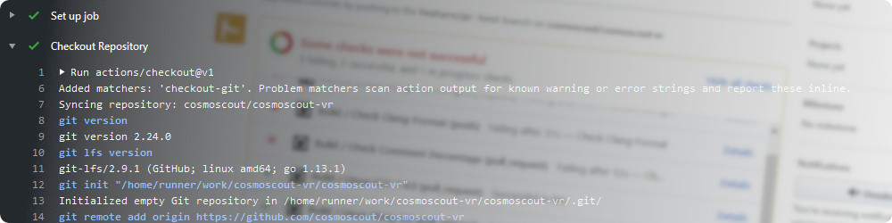

 
  

# Continuous Integration

[Github Actions](https://github.com/cosmoscout/cosmoscout-vr/actions) is used for contiuous integration of CosmoScout VR.
The file [`build.yml`](../.github/workflows/build.yml) describes which jobs are run whenever a commit is pushed or a pull request is opened.

## Clang-Format Check
We enforce specific code formatting rules described in the file [`.clang-format`](../.clang-format).
For each and **every push event**, a job is executed which checks whether the code base obeys these rules.

Commits passing this check will be marked with a :heavy_check_mark:, when the style does not match the rules, the commit will receive a :x:.

## Comment Percentage Check
For **pull requests only**, a job is run which analyses the amount of comments in the source tree.
Therefore the percentage of source lines of code containing comments is calculated with the script [`cloc.sh`](../cloc.sh) and compared with the amount of comments in the base branch.

This test will pass if the amount of comments did not decrease.

## Builds & Tests
[Github Actions](https://github.com/cosmoscout/cosmoscout-vr/actions) is also used to compile the code of CosmoScout VR and all of its dependencies.
As this job takes quite some time, it is only executed for the events below:
  * For each push to `master` or `develop` if the commit message does not contain `[no-ci]`.
  * For each push to any branch if commit message contains `[run-ci]`.
  * For pull requests.

The code is compiled on Ubuntu (with GCC and Clang) and on Windows (with MSVC).
Tests are executed on all platforms and the results are uploaded to [coveralls.io](https://coveralls.io/github/cosmoscout/cosmoscout-vr).

### Caching

Both, the externals and CosmoScout's code itself is built with [ccache](https://ccache.dev/) and [clcache](https://github.com/frerich/clcache) in order to speed up build times by a factor of five.
Between job runs, the object file cache is stored with the [cache action](https://github.com/actions/cache).

  <a href="release-management.md">&lsaquo; Release Management</a>
  
  <a href="README.md">&#8962; Help Index</a>

