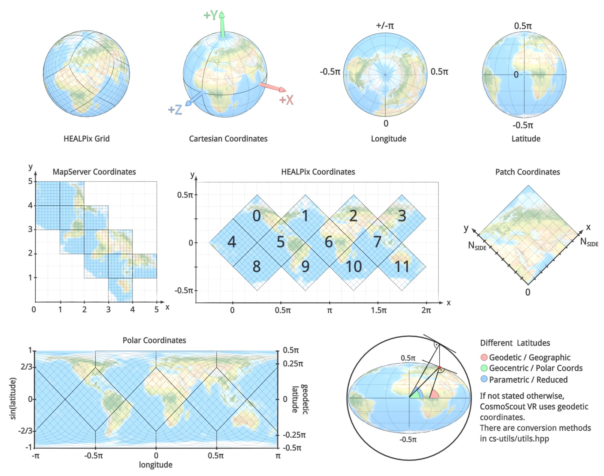

<!-- 
SPDX-FileCopyrightText: German Aerospace Center (DLR) <cosmoscout@dlr.de>
SPDX-License-Identifier: CC-BY-4.0
 -->

 
  

# Coordinate Systems of CosmoScout VR

CosmoScout VR uses many different coordinate systems. This page summarizes some conventions.
The HEALPix and MapServer coordinate systems are specific to the [csp-lod-bodies](https://github.com/cosmoscout/csp-lod-bodies) plugin.

 
  

  <a href="dependencies.md">&lsaquo; Dependencies</a>
  
  <a href="README.md">&#8962; Help Index</a>

