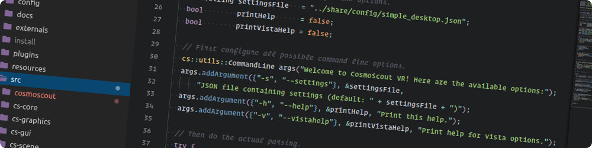

<p align="center"> 
  
</p>

# Configuring your IDE

Below you find some instructions on how to setup your preferred IDE for CosmoScout VR development. 

* [CLion](#clion-linux--windows)
* [Eclipse](#-eclipse-linux-only)
* [Sublime Text](#-sublime-text-linux--windows)
* [Visual Studio](#-visual-studio-windows-only)
* [Visual Studio Code](#-visual-studio-code-linux--windows)


## CLion (Linux & Windows)

### Linux

- (_optional_) If you want a debug build run `export COSMOSCOUT_DEBUG_BUILD=true`
- Run: `./make_externals.sh`
- Go to: _Settings_ -> _Build, Execution, Deployment_ -> _CMake_
- Release Profile
  - **Build Type**: `Release`
  - **Generation path**: `build/linux-Release`
  - **Build options**: `--parallel <your core count>`
  - **Environment**: If you haven't set `BOOST_ROOT` as a system wide environment variable you need to set it here!
  - **CMake options**:
    ```bash
    -DCMAKE_INSTALL_PREFIX="<path to cosmoscout>/install/linux-Release"
    -DCOSMOSCOUT_EXTERNALS_DIR="<path to cosmoscout>/install/linux-externals-Release"
    -DCMAKE_EXPORT_COMPILE_COMMANDS=On
    ```
    
- Debug Profile
  - **Build Type**: `Debug`
  - **Generation path**: `build/linux-Debug`
  - **Build options**: `--parallel <your core count>`
  - **Environment**: If you haven't set `BOOST_ROOT` as a system wide environment variable you need to set it here!
  - **CMake options**:
    ```
    -DCMAKE_INSTALL_PREFIX="<path to cosmoscout>/install/linux-Debug"
    -DCOSMOSCOUT_EXTERNALS_DIR="<path to cosmoscout>/install/linux-externals-Debug"
    -DCMAKE_EXPORT_COMPILE_COMMANDS=On
    ```

- Wait for CMake to be configured.
- Run the `Install` task. It can be found under `Build` in the menubar.
- Go to: _Run/Debug Configuration_ -> _CMake Application_ -> _cosmoscout_
- Release profile
  - **Target**: `cosmoscout`
  - **Executable** -> _Select other_ -> `<path to cosmoscout>/install/linux-Release/bin/cosmoscout`
  - **Program arguments**: `--settings=../share/config/simple_desktop.json -vista vista.ini`
  - **Environment variables**: `LD_LIBRARY_PATH=../lib:../lib/DriverPlugins:$LD_LIBRARY_PATH;VISTACORELIBS_DRIVER_PLUGIN_DIRS=../lib/DriverPlugins`
  - **Before launch** -> __--__ -> _Build_
  - **Before launch** -> __+__ -> _Install_
- Debug profile
  - **Target**: `cosmoscout`
  - **Executable** -> _Select other_ -> `<path to cosmoscout>/install/linux-Debug/bin/cosmoscout`
  - **Program arguments**: `--settings=../share/config/simple_desktop.json -vista vista.ini`
  - **Environment variables**: `LD_LIBRARY_PATH=../lib:../lib/DriverPlugins:$LD_LIBRARY_PATH;VISTACORELIBS_DRIVER_PLUGIN_DIRS=../lib/DriverPlugins`
  - **Before launch** -> __--__ -> _Build_
  - **Before launch** -> __+__ -> _Install_

### Windows

You need to install Visual Studio beforehand. If you are not bound to a specific version use the latest Visual Studio.

The following will use `-G "Visual Studio 16 2019" -A x64` as the compilation target, you can replace it with your 
highest available (and supported) version.

- (_optional_) If you want a debug build run `set COSMOSCOUT_DEBUG_BUILD=true`
- Run: `.\make_externals.bat -G "Visual Studio 16 2019" -A x64`
- Go to: _Settings_ -> _Build, Execution, Deployment_ -> _Toolchain_
  - Add Visual Studio if it is not in the list yet. And make sure it is at the top.
  - If Visual Studio is installed correctly everything else here should be set automagically.
- Go to: _Settings_ -> _Build, Execution, Deployment_ -> _CMake_
- Release Profile
  - **Build Type**: `Release`
  - **Generation path**: `build\windows-Release`
  - **Build options**: `--parallel <your core count>`
  - **Environment**: If you haven't set `BOOST_ROOT` as a system wide environment variable you need to set it here!
  - **CMake options**:
    ```
    -G "Visual Studio 16 2019" -A x64
    -DCMAKE_INSTALL_PREFIX="<path to cosmoscout>\install\windows-Release"
    -DCOSMOSCOUT_EXTERNALS_DIR="<path to cosmoscout>\install\windows-externals-Release"
    ```

- Debug Profile
  - **Build Type**: `Debug`
  - **Generation path**: `build\windows-Debug`
  - **Build options**: `--parallel <your core count>`
  - **Environment**: If you haven't set `BOOST_ROOT` as a system wide environment variable you need to set it here!
  - **CMake options**:
    ```
    -G "Visual Studio 16 2019" -A x64
    -DCMAKE_INSTALL_PREFIX="<path to cosmoscout>\install\windows-Debug"
    -DCOSMOSCOUT_EXTERNALS_DIR="<path to cosmoscout>\install\windows-externals-Debug"
    ```

- Wait for CMake to be configured.
- Run the `Install` task. It can be found under `Build` in the menubar.
- Go to: _Run/Debug Configuration_ -> _CMake Application_ -> _cosmoscout_
- Release profile
  - **Target**: `cosmoscout`
  - **Executable** -> _Select other_: `<path to cosmoscout>\install\windows-Release\bin\cosmoscout.exe`
  - **Program arguments**: `--settings=../share/config/simple_desktop.json -vista vista.ini`
  - **Environment variables**: `VISTACORELIBS_DRIVER_PLUGIN_DIRS=..\lib\DriverPlugins;PATH=..\lib\;%PATH%`
  - **Before launch** -> __--__ -> _Build_
  - **Before launch** -> __+__ -> _Install_
- Debug profile
  - **Target**: `cosmoscout`
  - **Executable** -> _Select other_: `<path to cosmoscout>\install\windows-Debug\bin\cosmoscout.exe`
  - **Program arguments**: `--settings=../share/config/simple_desktop.json -vista vista.ini`
  - **Environment variables**: `VISTACORELIBS_DRIVER_PLUGIN_DIRS=..\lib\DriverPlugins;PATH=..\lib\;%PATH%`
  - **Before launch** -> __--__ -> _Build_
  - **Before launch** -> __+__ -> _Install_
  
### Plugins
For CLion, we can recommended these plugins for the development of CosmoScout VR:
- [.gitignore](https://plugins.jetbrains.com/plugin/7495--ignore/)
- [Awesome Console](https://plugins.jetbrains.com/plugin/7677-awesome-console/)
- [CMake Simple Highlighter](https://plugins.jetbrains.com/plugin/10089-cmake-simple-highlighter)
- [CodeGlance](https://plugins.jetbrains.com/plugin/7275-codeglance/)
- [GitToolBox](https://plugins.jetbrains.com/plugin/7499-gittoolbox/)
- [GLSL Support](https://plugins.jetbrains.com/plugin/6993-glsl-support/)
- [Rainbow Brackets](https://plugins.jetbrains.com/plugin/10080-rainbow-brackets)

##  Eclipse (Linux only)

_TODO_ Currently nobody tried to use CosmoScout VR with Eclipse yet. If you do manage to set up CosmoScout with this IDE
we would be glad if you could make a pull request with set up instructions.

##  Sublime Text (Linux & Windows)

To get started with Sublime Text 3, you can create a project file in the root directory of CosmoScout VR:

### `CosmoScout VR.sublime-project`

```json
{
    "build_systems":
    [
        {
            "name": "Make (Release)",
            "file_regex": "^(..[^:]*):([0-9]+):?([0-9]+)?:? (.*)$",
            "cmd": "./make.sh -DCOSMOSCOUT_UNIT_TESTS=On",
            "working_dir": "$project_path",
            "windows": {
                "cmd": "make.bat -DCOSMOSCOUT_UNIT_TESTS=On"
            },
        },
        {
            "name": "Make (Debug)",
            "file_regex": "^(..[^:]*):([0-9]+):?([0-9]+)?:? (.*)$",
            "cmd": "./make.sh -DCOSMOSCOUT_UNIT_TESTS=On",
            "working_dir": "$project_path",
            "env": {
                "COSMOSCOUT_DEBUG_BUILD": "true"
            },
            "windows": {
                "cmd": "make.bat -DCOSMOSCOUT_UNIT_TESTS=On"
            },
        },
        {
            "name": "Make Externals (Release)",
            "file_regex": "^(..[^:]*):([0-9]+):?([0-9]+)?:? (.*)$",
            "cmd": "./make_externals.sh",
            "working_dir": "$project_path",
            "windows": {
                "cmd": "make_externals.bat"
            }
        },
        {
            "name": "Make Externals (Debug)",
            "file_regex": "^(..[^:]*):([0-9]+):?([0-9]+)?:? (.*)$",
            "cmd": "./make_externals.sh",
            "working_dir": "$project_path",
            "windows": {
                "cmd": "make_externals.bat"
            },
            "env": {
                "COSMOSCOUT_DEBUG_BUILD": "true"
            }
        },
        {
            "name": "Run CosmoScout VR",
            "cmd": "install/linux-Release/bin/start.sh",
            "working_dir": "$project_path",
            "windows": {
                "cmd": "install\\windows-Release\\bin\\start.bat"
            }
        }
    ],
    "folders":
    [
        {
            "path": "."
        }
    ]
}
```

Now you can press `Ctrl-B` to bring up the build system selection.
When you press this the next time, it will execute the build system selected previously.
Press `Ctrl-Shift-B` to select another build system.
You should first select `Make Externals (Release)`, then `Make (Release)` and later `Run CosmoScout VR`.

While this will give you a basic build system, it will not allow for auto-completion or debugging.

##  Visual Studio (Windows only)

First, you should follow the [Generic Build Instructions](install.md) for Windows. Once CosmoScout VR has been compiled successfully, you can simply open the `cosmoscout-vr.sln` solution in either `build\windows-Debug` or `build\windows-Release`.

Due to the build process of CosmoScout VR, this solution can only be used for Debug or Release mode respectively. Therefore you have to select the corresponding configuration type in Visual Studio.

##  Visual Studio Code (Linux & Windows)

For Visual Studio Code, only the [C/C++ Extension](https://marketplace.visualstudio.com/items?itemName=ms-vscode.cpptools) is required.
However, we can also recommend the following extensions: [CMake](https://marketplace.visualstudio.com/items?itemName=twxs.cmake), [Markdown Preview Github Styling](https://marketplace.visualstudio.com/items?itemName=bierner.markdown-preview-github-styles) and [Code Spell Checker](https://marketplace.visualstudio.com/items?itemName=streetsidesoftware.code-spell-checker).

In order to get started, you will need to create three files in a `.vscode` directory in the root of CosmoScout's source tree, namely `.vscode/tasks.json`, `.vscode/launch.json` and `.vscode/c_cpp_properties.json`.
We will discuss these files in the following.

### `.vscode/tasks.json`

```json
{
  "version": "2.0.0",
  "tasks": [
    {
      "label": "Make (Release)",
      "type": "shell",
      "command": "./make.sh -DCOSMOSCOUT_UNIT_TESTS=On",
      "options": {
        "cwd": "${workspaceFolder}"
      },
      "problemMatcher": [
        "$gcc"
      ],
      "windows": {
        "command": ".\\make.bat -DCOSMOSCOUT_UNIT_TESTS=On",
        "options": {
          "env": {
            "BOOST_ROOT": "C:\\local\\boost_1_69_0"
          }
        }
      }
    },
    {
      "label": "Make (Debug)",
      "type": "shell",
      "command": "./make.sh -DCOSMOSCOUT_UNIT_TESTS=On",
      "options": {
        "cwd": "${workspaceFolder}",
        "env": {
          "COSMOSCOUT_DEBUG_BUILD": "true"
        }
      },
      "problemMatcher": [
        "$gcc"
      ],
      "windows": {
        "command": ".\\make.bat -DCOSMOSCOUT_UNIT_TESTS=On",
        "options": {
          "env": {
            "BOOST_ROOT": "C:\\local\\boost_1_69_0"
          }
        }
      }
    },
    {
      "label": "Make Externals (Release)",
      "type": "shell",
      "command": "./make_externals.sh",
      "options": {
        "cwd": "${workspaceFolder}"
      },
      "problemMatcher": [
        "$gcc"
      ],
      "windows": {
        "command": ".\\make_externals.bat"
      }
    },
    {
      "label": "Make Externals (Debug)",
      "type": "shell",
      "command": "./make_externals.sh",
      "options": {
        "cwd": "${workspaceFolder}",
        "env": {
          "COSMOSCOUT_DEBUG_BUILD": "true"
        }
      },
      "problemMatcher": [
        "$gcc"
      ],
      "windows": {
        "command": ".\\make_externals.bat"
      }
    },
    {
      "label": "Run CosmoScout VR (Release)",
      "type": "shell",
      "command": "install/linux-Release/bin/start.sh",
      "options": {
        "cwd": "${workspaceFolder}"
      },
      "problemMatcher": [],
      "windows": {
        "command": ".\\install/windows-Release/bin/start.bat"
      }
    },
    {
      "label": "Run CosmoScout VR (Debug)",
      "type": "shell",
      "command": "install/linux-Debug/bin/start.sh",
      "options": {
        "cwd": "${workspaceFolder}"
      },
      "problemMatcher": [],
      "windows": {
        "command": ".\\install/windows-Debug/bin/start.bat"
      }
    },
    {
      "label": "Run Tests (Release)",
      "type": "shell",
      "command": "install/linux-Release/bin/run_tests.sh",
      "options": {
        "cwd": "${workspaceFolder}"
      },
      "problemMatcher": [],
      "windows": {
        "command": ".\\install/windows-Release/bin/run_tests.bat"
      }
    },
    {
      "label": "Run Tests (Debug)",
      "type": "shell",
      "command": "install/linux-Debug/bin/run_tests.sh",
      "options": {
        "cwd": "${workspaceFolder}"
      },
      "problemMatcher": [],
      "windows": {
        "command": ".\\install/windows-Debug/bin/run_tests.bat"
      }
    }
  ]
}
```

If you are on Windows, you may have to replace the `"BOOST_ROOT"` environment variable in this file.

With this file in place, you can press `Ctrl+Shift+P` and select `Tasks: Run Task`. Now you can first select `Make Externals (Release)`, then `Make (Release)` and later `Run CosmoScout VR`.

:information_source: _**Tip (Linux only):** You can use [ccache](https://ccache.dev/) to considerably speed up build times. You just need to replace the commands with `./make_externals.sh -G "Unix Makefiles" -DCMAKE_CXX_COMPILER_LAUNCHER=ccache -DCMAKE_C_COMPILER_LAUNCHER=ccache` and `./make.sh -G "Unix Makefiles" -DCMAKE_CXX_COMPILER_LAUNCHER=ccache -DCMAKE_C_COMPILER_LAUNCHER=ccache` respectively._

:information_source: _**Tip (Windows only):** You can use [clcache](https://github.com/frerich/clcache) to considerably speed up build times. You just need to call `make_externals.bat -G "Visual Studio 15 Win64" -DCMAKE_VS_GLOBALS=CLToolExe="clcache.exe;TrackFileAccess=false"` and `make.bat -G "Visual Studio 15 Win64" -DCMAKE_VS_GLOBALS="CLToolExe=clcache.exe;TrackFileAccess=false"` respectively._

### `.vscode/c_cpp_properties.json`

```json
{
    "configurations": [
        {
            "name": "Linux",
            "compileCommands": "${workspaceRoot}/build/linux-Release/compile_commands.json",
            "browse": {
                "databaseFilename": "${workspaceRoot}/.vscode/browse-linux.VC.db"
            },
            "includePath": [
                "${workspaceRoot}/build/linux-Release/**"
            ],
            "defines": [],
            "cStandard": "c11",
            "cppStandard": "c++17",
            "intelliSenseMode": "clang-x64"
        },
        {
            "name": "Win32",
            "browse": {
                "databaseFilename": "${workspaceRoot}/.vscode/browse-windows.VC.db"
            },
            "includePath": [
                "${workspaceRoot}/build/windows-Release/**",
                "${workspaceRoot}/install/windows-externals-Release/include"
            ],
            "defines": [],
            "cStandard": "c11",
            "cppStandard": "c++17"
        }
    ],
    "version": 4
}
```

This file configures Intellisense. On Linux, the CMake flag `-DCMAKE_EXPORT_COMPILE_COMMANDS=On` is used in `make.sh` to create a database which is required by Intellisense. With this file and the [C/C++ Extension](https://marketplace.visualstudio.com/items?itemName=ms-vscode.cpptools), autocompletion and similar functionality should be working both on Windows and on Linux.

### `.vscode/launch.json`

```json
{
  "version": "0.2.0",
  "configurations": [
    {
      "name": "Debugger (Linux)",
      "type": "cppdbg",
      "request": "launch",
      "program": "${workspaceFolder}/install/linux-Debug/bin/cosmoscout",
      "args": [
        "--settings=../share/config/simple_desktop.json",
        "-vistaini vista.ini"
      ],
      "stopAtEntry": false,
      "cwd": "${workspaceFolder}/install/linux-Debug/bin",
      "environment": [
        {
          "name": "VISTACORELIBS_DRIVER_PLUGIN_DIRS",
          "value": "../lib/DriverPlugins"
        },
        {
          "name": "LD_LIBRARY_PATH",
          "value": "../lib:../lib/DriverPlugins:${env:LD_LIBRARY_PATH}"
        }
      ],
      "externalConsole": false,
      "MIMode": "gdb",
      "setupCommands": [
        {
          "description": "Enable pretty-printing for gdb",
          "text": "-enable-pretty-printing",
          "ignoreFailures": true
        }
      ]
    },
    {
      "name": "Debugger (Windows)",
      "type": "cppvsdbg",
      "request": "launch",
      "program": "${workspaceFolder}/install/windows-Debug/bin/cosmoscout",
      "args": [
        "--settings=../share/config/simple_desktop.json",
        "-vistaini vista.ini"
      ],
      "stopAtEntry": false,
      "cwd": "${workspaceFolder}/install/windows-Debug/bin",
      "environment": [
        {
          "name": "VISTACORELIBS_DRIVER_PLUGIN_DIRS",
          "value": "..\\lib\\DriverPlugins"
        },
        {
          "name": "PATH",
          "value": "../lib;${env:PATH}"
        }
      ],
      "externalConsole": false
    }
  ]
}
```

Finally, when this files is created, you can use `F5` to launch the debugger on Windows and on Linux.
For this to work, CosmoScout VR and its dependencies have to be built in debug mode.

<p align="center"></p>
<p align="center">
  <a href="install.md">&lsaquo; Generic Build Instructions</a>
  
  <a href="README.md">&#8962; Help Index</a>
  
  <a href="using.md">Using CosmoScout VR &rsaquo;</a>
</p>
