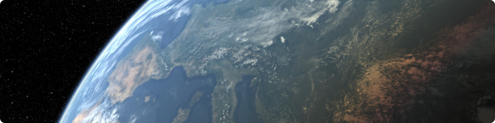

<p align="center"> 
  
</p>

# Generic Build Instructions

:information_source: _**Tip:** This page contains generic build instructions for CosmoScout VR. Alternatively, you can follow a [guide specific to your IDE](ide-setup.md)._

**CosmoScout VR supports 64 bits only and can be build in debug and release mode on Linux and Windows.
You will need a copy of [CMake](https://cmake.org/) (version 3.13 or greater), [Boost](https://www.boost.org/) (version 1.69 or greater) and a recent C++ compiler (gcc 7, clang 5 or msvc 19).
For the compilation of the externals [Python](https://www.python.org/) is also required.**

When compiling from source, you can either choose the `master` branch which contains the code of the last stable release or you can switch to the `develop` branch to test the latest features.

## Linux

Before you start, it may be necessary to install some additional system packages.
As there are many distributions with varying default libs and available packages, giving an exhaustive list is difficult.
Here is an exemplary list for Ubuntu 20.04 which you have to adapt to your specific distribution:

```bash
sudo apt-get install git cmake build-essential xorg-dev libboost-all-dev libglu1-mesa-dev libssl-dev libxkbcommon0
```

### Cloning the repository

```shell
git clone https://github.com/cosmoscout/cosmoscout-vr.git
cd cosmoscout-vr
```

The default branch is `develop`, which contains the latest features. If you prefer to use the last stable release, you can switch to the `master` branch.

```shell
git checkout master
```

### Getting the dependencies

Per default, all dependencies are built in release mode using precompiled headers and unity builds where possible.
This behavior can be adjusted using some environment variables:

Variable | Default | Description
---------|---------|------------
`COSMOSCOUT_DEBUG_BUILD` | `false` | Set to `true` to build all dependencies and CosmoScout VR in debug mode.
`COSMOSCOUT_USE_UNITY_BUILD` | `true` | Set to `false` to disable unity builds.
`COSMOSCOUT_USE_PCH` | `true` | Set to `false` to prevent generation of precompiled headers.

You should set these as required before executing the scripts below.
This step only has to be done once.

```shell
git submodule update --init
./make_externals.sh -G "Unix Makefiles"
```

This will clone the repository to `cosmoscout-vr` configure and build all externals in `cosmoscout-vr/build/linux-externals-Release` and will install them to `cosmoscout-vr/install/linux-externals-Release`.
All parameters given to `make_externals.bat` will be forwarded to CMake. For example, you can change the CMake generator this way.

### Compiling CosmoScout VR

On Linux, one can either use the provided shell script ([make.sh](../make.sh)) or build the software manually using CMake. 
**Using the provided script** is easy and definitely the recommended way.

Per default, CosmoScout VR is built in release mode without precompiled headers and unity builds on linux, since it doesn't gain any time.
This behavior can be adjusted using some environment variables:

Variable | Default | Description
---------|---------|------------
`COSMOSCOUT_DEBUG_BUILD` | `false` | Set to `true` to build all dependencies and CosmoScout VR in debug mode.
`COSMOSCOUT_USE_UNITY_BUILD` | `false` | Set to `true` to enable unity builds.
`COSMOSCOUT_USE_PCH` | `false` | Set to `true` to enable generation of precompiled headers.

You should set these as required before executing the scripts below.

This script will configure and build CosmoScout VR in `cosmoscout-vr/build/linux-Release` and will install it to `cosmoscout-vr/install/linux-Release`.
Again, all parameters given to `make.sh` will be forwarded to CMake:

```shell
./make.sh -G "Unix Makefiles" -DCOSMOSCOUT_UNIT_TESTS=On
```


The application can be executed with:

```shell
./install/linux-Release/bin/start.sh
```

When started for the very first time, some example datasets will be downloaded from the internet.
**This will take some time!**
The progress of this operation is shown on the loading screen.

Since you specified `-DCOSMOSCOUT_UNIT_TESTS=On` at build time, you can now execute the unit tests with (the _graphical tests_ require [Xvfb](https://en.wikipedia.org/wiki/Xvfb) and [imagemagick](https://imagemagick.org/index.php) to be installed on your system. On Ubuntu: `sudo apt-get install xvfb imagemagick`):

```shell
./install/linux-Release/bin/run_tests.sh
./install/linux-Release/bin/run_graphical_tests.sh
```

:information_source: _**Tip:** If you wish, you can delete the directories `build` and `install` at any time in order to force a complete reconfiguration or re-installation._

For **manual compilation** follow the steps outlined in [make.sh](../make.sh).

:information_source: _**Tip:** You can use [ccache](https://ccache.dev/) to considerably speed up build times. You just need to call `./make_externals.sh -G "Unix Makefiles" -DCMAKE_CXX_COMPILER_LAUNCHER=ccache -DCMAKE_C_COMPILER_LAUNCHER=ccache` and `./make.sh -G "Unix Makefiles" -DCMAKE_CXX_COMPILER_LAUNCHER=ccache -DCMAKE_C_COMPILER_LAUNCHER=ccache` respectively._

## Windows

:warning: _**Warning:** During compilation of the externals, files with pretty long names are generated. Since Windows does not support paths longer 260 letters, you have to compile CosmoScout VR quite close to your file system root (`e.g. C:\cosmoscout-vr`). If you are on Windows 10, [you can disable this limit](https://www.howtogeek.com/266621/how-to-make-windows-10-accept-file-paths-over-260-characters/)._

### Cloning the repository

```batch
git clone https://github.com/cosmoscout/cosmoscout-vr.git
cd cosmoscout-vr
```

The default branch is `develop`, which contains the latest features. If you prefer to use the last stable release, you can switch to the `master` branch.

### Getting the dependencies

Getting a precompiled version of boost suitable for CosmoScout VR which will be found by CMake can be difficult: Older CMake versions fail to find boost versions which are too new; but on the other hand you need a rather new version if you use a very recent version of MSVC (e.g. 14.2, the one shipped with Visual Studio 2019). The "oldest" precompiled boost which you can get on SourceForge for MSVC 14.2 is version 1.70.0.

So using version 1.70.0 may work in most cases. You can get it from from https://sourceforge.net/projects/boost/files/boost-binaries/1.70.0

MSVC | Visual Studio | File | Link
--- | --- | --- | ---
14.2 | 2019 | `boost_1_70_0-unsupported-msvc-14.2-64.exe` | [download](https://sourceforge.net/projects/boost/files/boost-binaries/1.70.0/boost_1_70_0-unsupported-msvc-14.2-64.exe/download)
14.1 | 2017 | `boost_1_70_0-msvc-14.1-64.exe` | [download](https://sourceforge.net/projects/boost/files/boost-binaries/1.70.0/boost_1_70_0-msvc-14.1-64.exe/download)
14.0 | 2015 | `boost_1_70_0-msvc-14.0-64.exe` | [download](https://sourceforge.net/projects/boost/files/boost-binaries/1.70.0/boost_1_70_0-msvc-14.0-64.exe/download)

:information_source: _**Tip:** If you want that CosmoScout VR detects your 3DConnexion Space Navigator, you have to [download](https://3dconnexion.com/de/software-developer-program/) and install the 3DConnexion SDK. Then you need to add one line to the `make_externals.bat` but file as [described here](https://github.com/cosmoscout/cosmoscout-vr/blob/develop/make_externals.bat#L313)._


Then you have to compile the dependencies.
Per default, all dependencies are built in release mode using precompiled headers and unity builds where possible.
This behavior can be adjusted using some environment variables:

Variable | Default | Description
---------|---------|------------
`COSMOSCOUT_DEBUG_BUILD` | `false` | Set to `true` to build all dependencies and CosmoScout VR in debug mode.
`COSMOSCOUT_USE_UNITY_BUILD` | `true` | Set to `false` to disable unity builds.
`COSMOSCOUT_USE_PCH` | `true` | Set to `false` to prevent generation of precompiled headers.

You should set these as required before executing the scripts below.
This step only has to be done once.
If you are using Visual Studio 2017, you have to replace `-G "Visual Studio 16 2019" -A x64` with `-G "Visual Studio 15 Win64"`.

```batch
git submodule update --init
make_externals.bat -G "Visual Studio 16 2019" -A x64
```

This will clone the repository to `cosmoscout-vr` configure and build all externals in `cosmoscout-vr\build\windows-externals-Release` and will install them to `cosmoscout-vr\install\windows-externals-Release`.
All parameters given to `make_externals.bat` will be forwarded to CMake. For example, you can change the CMake generator this way.

### Compiling CosmoScout VR

For Windows, there is a batch script ([make.bat](../make.bat)) which can be used in the same way as the script for Linux.

Per default, CosmoScout VR is built in release mode using precompiled headers and unity builds.
This behavior can be adjusted using some environment variables:

Variable | Default | Description
---------|---------|------------
`COSMOSCOUT_DEBUG_BUILD` | `false` | Set to `true` to build all dependencies and CosmoScout VR in debug mode.
`COSMOSCOUT_USE_UNITY_BUILD` | `true` | Set to `false` to disable unity builds.
`COSMOSCOUT_USE_PCH` | `true` | Set to `false` to prevent generation of precompiled headers.

You should set these as required before executing the scripts below.

On Linux, boost is usually found automatically by CMake, on Windows you have to provide the `BOOST_ROOT` path.
**Replace the path in the command below to match your setup!**
Again, if you are using Visual Studio 2017, you have to replace `-G "Visual Studio 16 2019" -A x64` with `-G "Visual Studio 15 Win64"`.

```batch
set BOOST_ROOT=C:\local\boost_1_70_0
make.bat -G "Visual Studio 16 2019" -A x64 -DCOSMOSCOUT_UNIT_TESTS=On
```

This will configure and build CosmoScout VR in `cosmoscout-vr\build\windows-Release` and will install it to `cosmoscout-vr\install\windows-Release`.
The application can be executed with:

```batch
cd install\windows-Release\bin
start.bat
```

When started for the very first time, some example datasets will be downloaded from the internet.
**This will take some time!**
The progress of this operation is shown on the loading screen.

Since you specified `-DCOSMOSCOUT_UNIT_TESTS=On` at build time, you can now execute the unit tests with:

```batch
install\linux-Release\bin\run_tests.bat
```

:information_source: _**Tip:** If you wish, you can delete the directories `build` and `install` at any time in order to force a complete reconfiguration or re-installation._

:information_source: _**Tip:** You can use [clcache](https://github.com/frerich/clcache) to considerably speed up build times. You just need to call `make_externals.bat -G "Visual Studio 15 Win64" -DCMAKE_VS_GLOBALS="CLToolExe=clcache.exe;TrackFileAccess=false"` and `make.bat -G "Visual Studio 15 Win64" -DCMAKE_VS_GLOBALS=CLToolExe"=clcache.exe;TrackFileAccess=false"` respectively._

:information_source: _**Tip:** You can use Ninja as a generator. You need to run the following commands from the `x64 Native Tools Command Prompt for VS 20XX`:
`.\make_externals.bat -GNinja -DCMAKE_C_COMPILER=cl.exe -DCMAKE_CXX_COMPILER=cl.exe` and `.\make.bat -GNinja -DCMAKE_C_COMPILER=cl.exe -DCMAKE_CXX_COMPILER=cl.exe`.
This can reduce the compile times by a lot._


<p align="center"></p>
<p align="center">
  <a href="README.md">&#8962; Help Index</a>
  
  <a href="ide-setup.md">Setup your IDE &rsaquo;</a>
</p>
