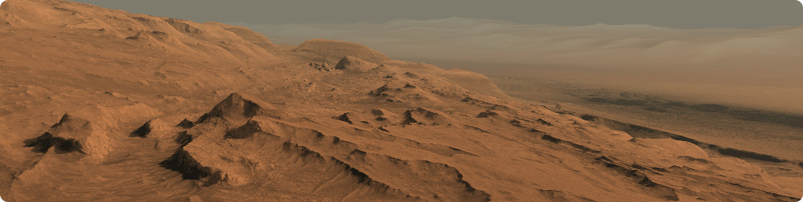

<p align="center"> 
  
</p>

# Build Instructions

CosmoScout VR can be build in debug and release mode on Linux and Windows. Most dependencies are included as [git submodules](externals). **You will only need a copy of [CMake](https://cmake.org/) (version 3.12 or greater), [Boost](https://www.boost.org/) (version 1.69 or greater) and a recent C++ compiler (gcc 7, clang 5 or msvc 19). For the compilation of the externals [Python](https://www.python.org/) is also required.**

## Linux

On Linux, one can either use the provided shell scripts ([make_release.sh](make_release.sh) and [make_debug.sh](make_debug.sh)) or build the software manually using CMake. **Using the provided scripts** is easy and definitely the recommended way.

In any way, first you have to compile the dependencies. This step only has to be done once.

```shell
git clone git@github.com:cosmoscout/cosmoscout-vr.git
cd cosmoscout-vr
git submodule update --init
./make_externals.sh
```

This will clone the repository to `cosmoscout-vr` configure and build all externals in `cosmoscout-vr/build/linux-externals` and will install them to `cosmoscout-vr/install/linux-externals`. For a minimal setup you will need some data sets which are not included in this git repository. Run this script to download the data to `cosmoscout-vr/data`:

```shell
./get_example_data.sh
```

Now you can compile CosmoScout VR:

```shell
./make_release.sh
```

This will configure and build CosmoScout VR in `cosmoscout-vr/build/linux-release` and will install it to `cosmoscout-vr/install/linux-release`. The application can be executed with:

```shell
cd install/linux-release/bin
./start.sh
```

If you which, you can delete the directories `build` and `install` at any time in order to force a complete reconfiguration or re-installation.

For **manual compilation** follow the steps outlined in [make_release.sh](make_release.sh) or [make_debug.sh](make_debug.sh).

## Windows

For Windows, there are batch scripts ([make_release.bat](make_release.bat) and [make_debug.bat](make_debug.bat)) which can be used in the same way as the scripts for Linux:

First you have to compile the dependencies. This step only has to be done once. Run the commands below from the Visual Studio Developer Command Line:

```batch
git clone git@github.com:cosmoscout/cosmoscout-vr.git
cd cosmoscout-vr
git submodule update --init
make_externals.bat
```

This will clone the repository to `cosmoscout-vr` configure and build all externals in `cosmoscout-vr\build\windows-externals` and will install them to `cosmoscout-vr\install\windows-externals`. For a minimal setup you will need some data sets which are not included in this git repository. Run this script to download the data to `cosmoscout-vr\data`:

```batch
get_example_data.bat
```

Now you can compile CosmoScout VR. On Linux, boost is usually found automatically by CMake, on Windows you have to provide the `BOOST_ROOT` path. **Replace the path in the command below to match your setup!**

```batch
set BOOST_ROOT=C:\local\boost_1_69_0
make_release.bat
```

This will configure and build CosmoScout VR in `cosmoscout-vr\build\windows-release` and will install it to `cosmoscout-vr\install\windows-release`. The application can be executed with:

```batch
cd install\windows-release\bin
start.bat
```

If you which, you can delete the directories `build` and `install` at any time in order to force a complete reconfiguration or re-installation.


## Complete List of Dependencies

The list below contains all dependencies of CosmoScout VR. Besides Boost, all of them are included either as [git submodules](externals) or directly in the source tree. Some of the dependencies are only required by some plugins.

| Engine Dependencies | Description | License |
|:---|:---|:---|
| [Boost (chrono, filesystem, date_time)](http://www.boost.org) | Used for time conversions and file system operations. | [Boost Software License](http://www.boost.org/LICENSE_1_0.txt) |
| [c-ares](https://c-ares.haxx.se) | A dependency of curl, used for asynchronous DNS requests. | [MIT](https://c-ares.haxx.se/license.html) |
| [Chromium Embedded Framework](https://bitbucket.org/chromiumembedded/cef) | For the Webkit based user interface. | [BSD](https://bitbucket.org/chromiumembedded/cef/raw/a5a5e7ff08129f4122437dfdbba93d2a746c5c59/LICENSE.txt) |
| [Curl](https://curl.haxx.se) | Library for downloading stuff from the Internet. | [MIT style](https://curl.haxx.se/legal/licmix.html) |
| [CurlPP](https://github.com/jpbarrette/curlpp) | C++ wrapper for curl. | [MIT style](https://github.com/jpbarrette/curlpp/blob/master/doc/LICENSE) |
| [FreeGlut](https://sourceforge.net/p/freeglut) | Windowing toolkit dependency of OpenSG. | [MIT](https://sourceforge.net/p/freeglut/code/HEAD/tree/trunk/freeglut/freeglut/COPYING) |
| [glew](http://glew.sourceforge.net) | OpenGL extension wrangler. | [Modified BSD](http://glew.sourceforge.net/glew.txt) |
| [glm](https://glm.g-truc.net) | Math library used throughout CosmoScout. | [Happy Bunny / MIT](https://glm.g-truc.net/copying.txt) |
| [JsonHPP](https://github.com/nlohmann/json) | Parses json files in C++. | [MIT](https://github.com/nlohmann/json/blob/develop/LICENSE.MIT) |
| [LibTiff](http://www.libtiff.org) | For .tiff image format support. | [BSD-like](http://www.libtiff.org/misc.html) |
| [OpenSG](https://sourceforge.net/p/opensg) | Scenegraph used as backend by Vista. | [LGPL](https://sourceforge.net/p/opensg/code/ci/master/tree/COPYING) |
| [OpenVR](https://github.com/ValveSoftware/openvr) | Adds support for the HTC-Vive. | [BSD 3-Clause](https://github.com/ValveSoftware/openvr/blob/master/LICENSE) |
| [SPICE](https://naif.jpl.nasa.gov/naif) | Library to compute positions of celestial objects. | [Custom License](https://naif.jpl.nasa.gov/naif/rules.html) |
| [STBImage](https://github.com/nothings/stb) | Library for loading .jpg and .png files. | [Public Domain](https://github.com/nothings/stb/blob/master/docs/why_public_domain.md) |
| [Vista](https://sourceforge.net/projects/vistavrtoolkit/) | VR-Framework for scenegraphs, distributed rendering and low-level VR-device access. | [LGPL](https://sourceforge.net/projects/vistavrtoolkit/) |
| [VRPN](https://github.com/vrpn/vrpn) | Used for supporting various hardware devices. | [Boost Software License](https://github.com/vrpn/vrpn/wiki/License) |
| [zlib](https://zlib.net) | Dependency of Vista. | [MIT style](https://zlib.net/zlib_license.html) |
| **UI Dependencies** | **Description** | **License** |
| [Alegreya Sans Font](https://fonts.google.com/specimen/Alegreya+Sans) | This font is used for the CosmoScout VR logo. | [Open Font License ](https://fonts.google.com/specimen/Alegreya+Sans) |
| [Bootstrap Date Picker](https://github.com/uxsolutions/bootstrap-datepicker) | The calendar in the user interface. | [Apache License 2.0](https://github.com/uxsolutions/bootstrap-datepicker/blob/master/LICENSE) |
| [D3.js](https://github.com/d3/d3) | Used for some tools (like path measurement) to draw graphs in the user interface. | [BSD 3-Clause](https://github.com/d3/d3/blob/master/LICENSE) |
| [fuzzyset.js](https://github.com/Glench/fuzzyset.js) | Used for the location search on other planets and moons. | [BSD](https://github.com/Glench/fuzzyset.js) |
| [jQuery](https://jquery.org) | JavaScript library which is used extensively in the user interface. | [MIT](https://jquery.org/license/) |
| [Material Icons](https://github.com/google/material-design-icons) | Icon set uses in the user interface. | [Apache License 2.0](https://github.com/google/material-design-icons/blob/master/LICENSE) |
| [MaterializeCSS](https://github.com/Dogfalo/materialize) | CSS-toolkit used in the user interface. | [MIT](https://github.com/Dogfalo/materialize/blob/master/LICENSE) |
| [noUiSlider](https://refreshless.com/nouislider) | JavaScript library for advanced sliders. | [WTFPL](http://www.wtfpl.net/about/) |
| [Ubuntu Font](https://design.ubuntu.com/font) | This font is used in the user interface of CosmoScout VR. | [Ubuntu font licence](https://www.ubuntu.com/legal/terms-and-policies/font-licence) |
| **Runtime Dependencies** | **Description** | **License** |
| [Apache built by Apachehaus](https://www.apachehaus.com/cgi-bin/download.plx) | This is a pre-compiled apache server for windows which can be used to run your own Mapserver. Only required by the `csp-lod-bodies` plugin. | [Apache License 2.0](https://www.apache.org/licenses/) |
| [GDAL](https://trac.osgeo.org/gdal) | Dependency of the Mapserver. Only required by the `csp-lod-bodies` plugin. | [X11/MIT](https://trac.osgeo.org/gdal/wiki/FAQGeneral#WhatlicensedoesGDALOGRuse) |
| [Mapserver](http://mapserver.org) | Used to provide map data over the internet. Only required by the `csp-lod-bodies` plugin. | [MIT](http://mapserver.org/copyright.html) |
| [proj.4](https://proj.org) | The `csp-lod-bodies` requires a [special version](https://github.com/cosmoscout/proj.4) of this library to be used by the Mapserver. | [MIT](https://proj.org/about.html) |

# License

Copyright (c) 2019 German Aerospace Center (DLR)

Permission is hereby granted, free of charge, to any person obtaining a copy
of this software and associated documentation files (the "Software"), to deal
in the Software without restriction, including without limitation the rights
to use, copy, modify, merge, publish, distribute, sublicense, and/or sell
copies of the Software, and to permit persons to whom the Software is
furnished to do so, subject to the following conditions:

The above copyright notice and this permission notice shall be included in all
copies or substantial portions of the Software.

THE SOFTWARE IS PROVIDED "AS IS", WITHOUT WARRANTY OF ANY KIND, EXPRESS OR
IMPLIED, INCLUDING BUT NOT LIMITED TO THE WARRANTIES OF MERCHANTABILITY,
FITNESS FOR A PARTICULAR PURPOSE AND NONINFRINGEMENT. IN NO EVENT SHALL THE
AUTHORS OR COPYRIGHT HOLDERS BE LIABLE FOR ANY CLAIM, DAMAGES OR OTHER
LIABILITY, WHETHER IN AN ACTION OF CONTRACT, TORT OR OTHERWISE, ARISING FROM,
OUT OF OR IN CONNECTION WITH THE SOFTWARE OR THE USE OR OTHER DEALINGS IN THE
SOFTWARE.
