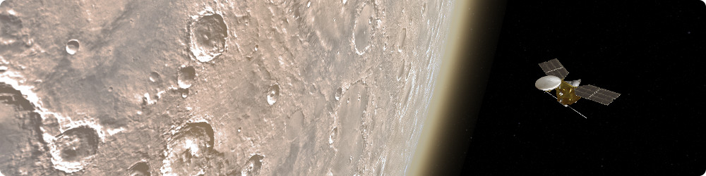

<p align="center"> 
  
</p>

# Migration Guide for CosmoScout VR

## Migrating from v1.2.0 to v1.3.0

Some aspects of the scene configuration JSON file have changed in this version. Here are the changes you will have to apply to your existing configurations:

* New required key `"resetDate"`: This should be either `"today"` or in the format `"1950-01-02 00:00:00.000"`. The simulation time will be set to this value when the reset button is clicked.
* The initial observer position and rotation is now given in Cartesian coordinates: The observer property is now structured like this:
  ```javascript
  "observer": {
    "center": "Earth",
    "frame": "IAU_Earth",
    "position": [0, 0, 25000000],
    "rotation": [0, 0, 0, 1]
  },
  ```
* `"events"` are now called `"bookmarks"` and structured like this:
  ```javascript
   "bookmarks": [
    {
      "name": "Mercury",
      "icon": "mercury.png",
      "location": {
        "center": "Mercury",
        "frame": "IAU_Mercury"
      }
    },
    {
      "name": "Apollo 17 Start",
      "description": "Start of the Apollo 17 mission from the Kennedy Space Center.",
      "color": [0.8, 0.8, 0.8],
      "location": {
        "center": "Earth",
        "frame": "IAU_Earth",
        "position": [-6717320.0, 3677613.0, 1137577.0],
        "rotation": [0.154, 0.634, 0.182, -0.735]
      },
      "time": {
        "start": "1972-12-07 05:33:57"
      }
    },
    ...
  ],
  ```
  Except for `"name"`, all properties are optional. You can supply a description, a color, a location (optionally with `position` and `rotation`) and a time.
* It is now required to have a `"graphics": {}` object, even if it is empty.
* The existence of anchors is now defined in a two-element array like this:
  ```javascript
  "Sun": {
    "center": "Sun",
    "frame": "IAU_Sun",
    "existence": [
      "1950-01-02 00:00:00.000",
      "2049-12-31 00:00:00.000"
    ]
  },
  ```
* All properties of `"csp-measurement-tools": {}` are now optional and can be omitted.
* `"csp-fly-to-locations": {}` now simply displays all `"bookmarks"` with a given location. Therefore the plugin has no configuration option anymore.
* The satellite configuration of `"csp-satellites"` has no `"transformation"` property anymore. The same effect can now be achieved with the `"position"`, `"rotation"` and `"scale"` properties of the anchor this satellite is attached to.

<p align="center"></p>
<p align="center">
  <a href="changelog.md">&lsaquo; Changelog</a>
  
  <a href="README.md">&#8962; Help Index</a>
  
  <a href="citation.md">How to cite CosmoScout VR &rsaquo;</a>
</p>
