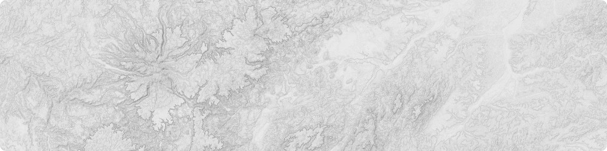
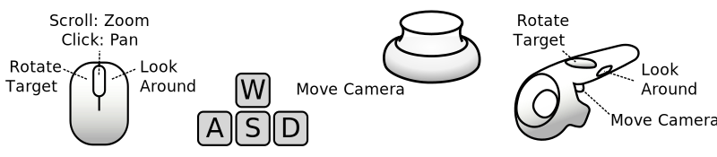

<!-- 
SPDX-FileCopyrightText: German Aerospace Center (DLR) <cosmoscout@dlr.de>
SPDX-License-Identifier: CC-BY-4.0
 -->

 
  

# Using CosmoScout VR

:construction: _**Under Construction:** This guide is still far from complete. We will improve it in the future._

:warning: _**Warning:** The [default configuration](../config/base/scene/simple_desktop.json) only contains a few data sets with very low resolution. Please read the [Configuring Guide](configuring.md) and the documentation of the [individual plugins](../README.md#Plugins-for-CosmoScout-VR) for including new data sets._

**Navigation:** There are several ways for interacting with the scene.
Currently mouse, keyboard and space navigator are supported.
More input devices can be added via VRPN.
The mouse navigation is still in development - while it is already quite useful, the user experience may be improved.

 
  

**Keyboard Shortcuts:** The most important one is `Alt-Enter` which will toggle full-screen mode.
`W`, `A`, `S`, `D` will move the virtual camera; `Q` and `E` can be used to control the roll; `R` and `F` can be used to control the altitude.
All other shortcuts can be shown by pressing `?`. They will be printed to the console window.

**User Interface:** When you start CosmoScout VR, you will see several user interface elements.
The top bar shows information regarding your current camera position, the position of the mouse pointer on the planets surface and the current simulation time (UTC).
In addition, there are some buttons controlling the simulation time.

On the left hand side is the main menu.
Here you can select which data sets are shown, manipulate the surface visualization, add annotations, fly to pre-defined locations and perform various other tasks.

  <a href="ide-setup.md">&lsaquo; Setup your IDE</a>
  
  <a href="README.md">&#8962; Help Index</a>
  
  <a href="configuring.md">Configuring CosmoScout VR &rsaquo;</a>

