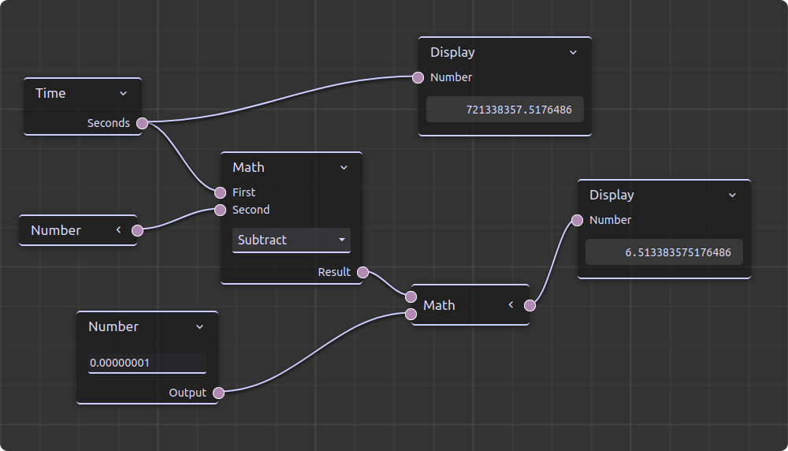

<!-- 
SPDX-FileCopyrightText: German Aerospace Center (DLR) <cosmoscout@dlr.de>
SPDX-License-Identifier: CC-BY-4.0
 -->

 
  

# Node Editor Library for CosmoScout VR

This plugin library provides a web server which serves a highly configurable node editor over an HTTP interface.
It can be used to create all kinds of data flow editors for CosmoScout VR.

_:information_source: The `csp-demo-node-editor` plugin provides an example use case for the node editor. Feel free to look into that plugin for a complete example on how to use the node editor._

## Basic Architecture

The node editor uses a web server which serves a web frontend on a given port via HTTP.
The user can access this frontend with a web browser and start creating a node graph.
For each created node or connection, a C++ counterpart is instantiated on the server.

Any data flow happens on the C++ side, the HTML / JavaScript graph is "just" a visualization of the graph.
Whenever a node in the graph needs to display some data, a message needs to be sent from the C++ server to the JavaScript frontend.
Similarly, whenever the user modifies the graph on the frontend, a message is sent to the C++ server.

Internally, the communication happens via a web socket.
At any given time, there can be only one open connection to a client.
If an additional client connects, an error message will be shown instead of the frontend web page.

### The `Node` base class

Nodes consist basically of two parts, a C++ class (which has to be derived from `Node`) and a JavaScript counterpart which is using [ReteJS](https://github.com/retejs/rete).
However, ReteJS is only used for editing and visualizing the graph, not for the actual data processing.
This always happens in the C++ class.

For learning how to create custom node types, you can have a look at the [`Node.hpp`](src/Node.hpp) or at the example nodes of the `csp-demo-node-editor` plugin.
This contains some easy-to-understand nodes which you can use as a basis for your custom
nodes.

### The `NodeFactory` class

For setting up a node editor with your custom node types, you will first have to instantiate a `NodeFactory`.
This class is used to register all socket and node types which should be available in a node editor instance.
The node editor will then use the given `NodeFactory` to instantiate the actual nodes.

More information on how to use this class is given in [`NodeFactory.hpp`](src/NodeFactory.hpp) and an example usage can be seen in the [`Plugin.cpp`](../csp-demo-node-editor/src/Plugin.cpp) of the `csp-demo-node-editor` plugin.

### The `NodeEditor` class

Finally, you can create an instance of the `NodeEditor` class, passing the previously created `NodeFactory` and the port for the web server.
You will have to call the `update()` method of the `NodeEditor` in regular intervals.
Once this is up and running, the `NodeEditor` should be ready to use!
