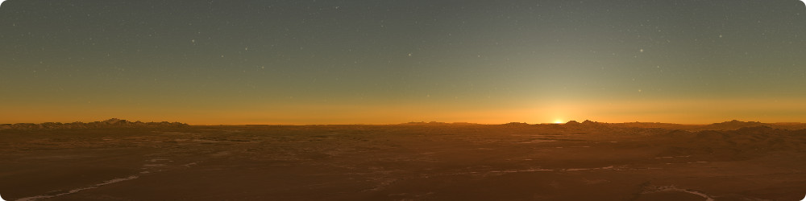

<!--
SPDX-FileCopyrightText: German Aerospace Center (DLR) <cosmoscout@dlr.de>
SPDX-License-Identifier: CC-BY-4.0
 -->

<p align="center"> 
  
</p>
 
# Precomputation of Multiple-Scattering Textures

The `bruneton-preprocessor` command-line tool precomputes the multiple scattering lookup tables for the `Bruneton` atmosphere model.
It consumes the CSV files generated by the `scattering-table-generator` tool and stores the resulting textures in the specified directory.

> [!IMPORTANT]
> This plugin uses code published by Eric Bruneton under the BSD-3-Clause license. Consequently, not all source files are available under the MIT license. See the individual SPDX-tags for details.

## Usage

> [!TIP]
> Per default, the atmosphere preprocessor is not built. To build it, you need to pass `-DCSP_ATMOSPHERES_PREPROCESSOR=On` in the make script.

The preprocessor assumes to be executed in the root of the `cosmoscout-vr` repository.
You'll need to set the library search path to contain the `install/<os>-<build_type>/lib` directory.
This depends on where the `bruneton-preprocessor` is installed to, but this may be something like this:

```bash
# For Windows (powershell)
cd cosmoscout-vr
$env:Path += ";install\windows-Release\lib"

# For Linux (bash)
cd cosmoscout-vr
export LD_LIBRARY_PATH=install/linux-Release/lib:$LD_LIBRARY_PATH
```

You can then execute the preprocessor with the following command:

```bash
# For Windows (powershell)
install\windows-Release\bin\bruneton-preprocessor <settings.json> <output directory>

# For Linux (bash)
install/linux-Release/bin/bruneton-preprocessor <settings.json> <output directory>
```

For instance, the currently used lookup tables were generated with the following command:

```bash
cd cosmoscout-vr
export LD_LIBRARY_PATH=install/linux-Release/lib:$LD_LIBRARY_PATH
install/linux-Release/bin/bruneton-preprocessor plugins/csp-atmospheres/bruneton-preprocessor/settings/earth.json plugins/csp-atmospheres/bruneton-preprocessor/output/earth
install/linux-Release/bin/bruneton-preprocessor plugins/csp-atmospheres/bruneton-preprocessor/settings/mars.json plugins/csp-atmospheres/bruneton-preprocessor/output/mars
```

### Configuration Files

The settings file is a JSON file that specifies the parameters for the precomputation.
You can see some example files in the [`settings`](settings) directory.

| Property                        | Default Value | Description                                                                                                                                                             |
| ------------------------------- | ------------- | ----------------------------------------------------------------------------------------------------------------------------------------------------------------------- |
| `minAltitude`                   | _mandatory_   | The radius of the lower atmosphere boundary in meters.                                                                                                                  |
| `maxAltitude`                   | _mandatory_   | The radius of the upper atmosphere boundary in meters.                                                                                                                  |
| `sunDistance`                   | _mandatory_   | The average distance to the Sun in meters.                                                                                                                              |
| `molecules`                     | _mandatory_   | This object should contain `"phase"`, `"betaSca"`, `"betaAbs"`, and `"density"` CSV file paths to the respective files generated with the `scattering-table-generator`. |
| `aerosols`                      | _mandatory_   | This object should contain `"phase"`, `"betaSca"`, `"betaAbs"`, and `"density"` CSV file paths to the respective files generated with the `scattering-table-generator`. |
| `ozone`                         | _optional_    | If specified, this object should contain `"betaAbs"` and `"density"` CSV file paths to the respective files generated with the `scattering-table-generator`.            |
| `groundAlbedo`                  | `0.1`         | The average reflectance of the ground used during multiple scattering.                                                                                                  |
| `multiScatteringOrder`          | `4`           | The number of multiple scattering events to precompute. Use zero for single-scattering only.                                                                            |
| `sampleCountOpticalDepth`       | `500`         | The number of samples to evaluate when precomputing the optical depth.                                                                                                  |
| `sampleCountSingleScattering`   | `50`          | The number of samples to evaluate when precomputing the single scattering. Larger values improve the sampling of thin atmospheric layers.                               |
| `sampleCountMultiScattering`    | `50`          | The number of samples to evaluate when precomputing the multiple scattering. Larger values tend to darken the horizon for thick atmospheres.                            |
| `sampleCountScatteringDensity`  | `16`          | The number of samples to evaluate when precomputing the scattering density. Larger values spread out colors in the sky.                                                 |
| `sampleCountIndirectIrradiance` | `32`          | The number of samples to evaluate when precomputing the indirect irradiance.                                                                                            |
| `transmittanceTextureWidth`     | `256`         | The horizontal resolution of the transmittance texture. Larger values can improve the sampling of thin atmospheric layers close to the horizon.                         |
| `transmittanceTextureHeight`    | `64`          | The vertical resolution of the transmittance texture. Larger values can improve the sampling of thin atmospheric layers close to the horizon.                           |
| `scatteringTextureRSize`        | `32`          | Larger values improve sampling of thick low-altitude layers.                                                                                                            |
| `scatteringTextureMuSize`       | `128`         | Larger values reduce circular banding artifacts around zenith for thick atmospheres.                                                                                    |
| `scatteringTextureMuSSize`      | `32`          | Larger values reduce banding in the day-night transition when seen from space.                                                                                          |
| `scatteringTextureNuSize`       | `8`           | Larger values reduce circular banding artifacts around sun for thick atmospheres.                                                                                       |
| `irradianceTextureWidth`        | `64`          | The horizontal resolution of the irradiance texture.                                                                                                                    |
| `irradianceTextureHeight`       | `16`          | The vertical resolution of the irradiance texture.                                                                                                                      |
