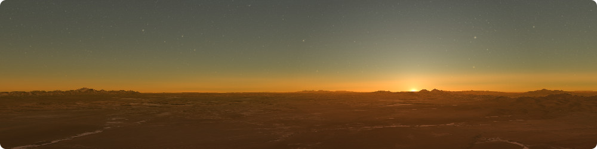

<!-- 
SPDX-FileCopyrightText: German Aerospace Center (DLR) <cosmoscout@dlr.de>
SPDX-License-Identifier: CC-BY-4.0
 -->

<p align="center"> 
  
</p>
 
# Atmosphere Lookup-Texture Generator

This tool can be used to precompute the atmospheric data required for the advanced `"Bruneton"` atmosphere model used by CosmoScout VR.
It generates tabulated phase functions, scattering coefficients, absorption coefficients, and density distributions.
The resulting data is stored in CSV files and loaded by CosmoScout VR at runtime.

## Usage

> [!IMPORTANT]
> Per default, the atmosphere preprocessor is not built. To build it, you need to pass `-DCS_ATMOSPHERE_PREPROCESSOR=On` in the make script.

Once compiled, you'll need to set the library search path to contain the `install/<os>-<build_type>/lib` directory.
This depends on where the `atmosphere-preprocessor` is installed to, but this may be something like this:

```powershell
# For powershell
cd install\windows-Release\bin
$env:Path += ";..\lib"

# For bash
cd install/linux-Release/bin
export LD_LIBRARY_PATH=../lib:$LD_LIBRARY_PATH
```

### The Preprocessing Modes

There are many ways phase functions, scattering coefficients, and absorption coefficients can be computed.
This tool provides means to compute them physically-based using Mie Theory as well as several approximations which have been used in the literature.
To learn about the different operation modes, you can now issue this command:

```bash
./atmosphere-preprocessor --help
```

> [!NOTE]
> Unless stated otherwise, length units must always be given in m. For instance, this is true for altitudes, wavelengths, and for particle radii.

Mode | Description
---- | -----------
`mie` | This mode computes phase functions as well as scattering- and absorption coefficients for a given particle mixture using Mie Theory. The particle mixture follows a specified multi-modal size distribution and can have a complex, wavelength-dependent refractive index. Use `./atmosphere-preprocessor mie --help` to learn about all the options. Also, below a multiple examples to get you started.
`rayleigh` | This mode writes the phase function and scattering coefficients of Rayleigh molecules for the specified wavelengths. Use `./atmosphere-preprocessor rayleigh --help` to learn about all the options.
`angstrom` | This mode writes scattering, and absorption coefficients based on Ångström's turbidity formula and a single-scattering albedo value. Use `./atmosphere-preprocessor angstrom --help` to learn about all the options.
`hulst` | This mode writes scattering, and absorption coefficients based on van de Hulst's Anomalous Diffraction Approximation and the turbidity approximation used in the Costa paper. Use `./atmosphere-preprocessor hulst --help` to learn about all the options.
`manual` | This mode writes some user-specified values for the scattering coefficients or absorption coefficients for the specified wavelengths. Use `./atmosphere-preprocessor manual --help` to learn about all the options.
`cornette` `henyey` `dhenyey` | These modes write either the Cornette-Shanks, the Henyey-Greenstein, or the Double-Henyey-Greenstein parametric phase function for the specified wavelengths. Use `./atmosphere-preprocessor <mode> --help` to learn about all the options.
`ozone` | This mode writes the absorption coefficients of ozone molecules for the specified wavelengths. Use `./atmosphere-preprocessor ozone --help` to learn about all the options.
`density` | This mode samples a given multi-modal density function at evenly spaced altitudes and writes the resulting data. Use `./atmosphere-preprocessor density --help` to learn about all the options.

## The CSV Files

The different modes produce CSV files which are all in the same format and can be directly used in CosmoScout VR.
Here, we describe shortly what data is stored in the CSV files.
With this information, it is possible to produce similar files with different tools or even by hand.

### Phase Functions

Phase function intensity values are stored per wavelength and per scattering angle.
Each row corresponds to a phase function sampled at evenly spaced angles for a specific wavelength.
Here is how this could look like:

```csv
lambda,  0.0,   1.0,   2.0,   ..., 180.0
3.6e-07, 0.933, 0.931, 0.923, ..., 0.022
3.9e-07, 0.857, 0.857, 0.856, ..., 0.023
...,     ...,   ...,   ...,   ..., ...
8.3e-07, 0.091, 0.091, 0.091, ..., 0.045
```

### Extinction Coefficients

Scattering (`beta_sca`) and absorption (`beta_abs`) coefficients are stored per wavelength as well.
Their unit is [m^-1].
Here is how this could look like:

```csv
lambda,  beta_sca
3.6e-07, 5.70e-07
3.9e-07, 5.33e-07
...,     ...
8.3e-07, 1.00e-07
```

### Density Distributions

The particle density is stored at evenly space altitudes between the specified `--min-altitude` and `--max-altitude`.
The maximum density is 1.0.
The first density value in the CSV file corresponds to the `--min-altitude` and the last value to `--max-altitude`.
Here is how this could look like:

```csv
density
1.0
0.9369102299935942
0.8778007790666494
...
0.0
```

## Pre-processing Examples

> [!IMPORTANT]
> It is required, that for one atmosphere, all components provide tabulated values for the same number of wavelengths, phase-function angles, and altitudes. Else CosmoScout VR will report an error.

Per default, all modes will sample 15 wavelengths from 360nm to 830nm.
Phase functions will use 181 samples per default and the `density` mode will sample at 1024 different altitudes between 0m and 80km.

### Earth

Below are the input values which we currently use for Earth's atmosphere in CosmoScout VR.

```bash
# Molecules
./atmosphere-preprocessor density -i ../../../plugins/csp-atmospheres/preprocessor/density-settings/earth_bruneton_molecules.json -o earth_cosmoscout_molecules
./atmosphere-preprocessor rayleigh --scattering-depolarization 0.0279 --phase-depolarization 0.0279 --penndorf-ior --theta-samples 91 -o earth_cosmoscout_molecules

# Aerosols
./atmosphere-preprocessor density -i ../../../plugins/csp-atmospheres/preprocessor/density-settings/earth_bruneton_aerosols.json -o earth_cosmoscout_aerosols
./atmosphere-preprocessor mie -i ../../../plugins/csp-atmospheres/preprocessor/mie-settings/earth_haze.json --theta-samples 91 --number-density 5e8 --radius-samples 10000 -o earth_cosmoscout_aerosols

# Ozone
./atmosphere-preprocessor density -i ../../../plugins/csp-atmospheres/preprocessor/density-settings/earth_bruneton_ozone.json -o earth_cosmoscout_ozone
./atmosphere-preprocessor ozone -o earth_cosmoscout_ozone
```

### Mars

Below are the input values which we currently use for the Martian atmosphere in CosmoScout VR.

```bash
# Molecules
./atmosphere-preprocessor density -i ../../../plugins/csp-atmospheres/preprocessor/density-settings/mars_cosmoscout_molecules.json -o mars_cosmoscout_molecules
./atmosphere-preprocessor rayleigh --ior 1.00000337 --scattering-depolarization 0.09 --phase-depolarization 0.09 --number-density 2.05e23 --theta-samples 91 -o mars_cosmoscout_molecules

# Aerosols
./atmosphere-preprocessor density -i ../../../plugins/csp-atmospheres/preprocessor/density-settings/mars_cosmoscout_aerosols.json -o mars_cosmoscout_aerosols
./atmosphere-preprocessor mie -i ../../../plugins/csp-atmospheres/preprocessor/mie-settings/mars_bimodal.json --theta-samples 91 --number-density 5e9 --radius-samples 10000 -o mars_cosmoscout_aerosols
```

## Creating Atmospheres According to Different Papers

We can use the generic format of tabulated phase functions, scattering coefficients, absorption coefficients, and density distributions to recreate previous works.
Here we provide the parametrization for various other models for Earth and Mars recreated with our approach.

### [Earth] Bruneton et al.: [Precomputed Atmospheric Scattering](https://inria.hal.science/inria-00288758/en)

In this work, **molecules** are modelled using standard Rayleigh scattering. However, neither the molecular number density nor the index of refraction is given.
Hence, we use the explicitly given numbers.
**Aerosols** use a wavelength-independent Cornette-Shanks phase function.
The scattering coefficient of 2.1e-3 given in the paper seems very large.
If we divide it by 100, we get plausible results.

```bash
# Molecules
./atmosphere-preprocessor density -i ../../../plugins/csp-atmospheres/preprocessor/density-settings/earth_bruneton_molecules.json -o earth_bruneton2008_molecules
./atmosphere-preprocessor rayleigh --lambdas 440e-9,550e-9,680e-9 -o earth_bruneton2008_molecules
./atmosphere-preprocessor manual --lambdas 440e-9,550e-9,680e-9 --quantity beta_sca --values 33.1e-6,15.5e-6,5.8e-6 -o earth_bruneton2008_molecules_scattering

# Aerosols
./atmosphere-preprocessor density -i ../../../plugins/csp-atmospheres/preprocessor/density-settings/earth_bruneton_aerosols.json -o earth_bruneton2008_aerosols
./atmosphere-preprocessor cornette --lambdas 440e-9,550e-9,680e-9 --g 0.76 -o earth_bruneton2008_aerosols
./atmosphere-preprocessor manual --lambdas 440e-9,550e-9,680e-9 --quantity beta_sca --values 2.1e-5 -o earth_bruneton2008_aerosols_scattering
./atmosphere-preprocessor manual --lambdas 440e-9,550e-9,680e-9 --quantity beta_abs --values 2.1e-6 -o earth_bruneton2008_aerosols_absorption
```

### [Earth] E. Bruneton: [A Qualitative and Quantitative Evaluation of 8 Clear Sky Models](https://arxiv.org/abs/1612.04336)

In his 2016 paper, Eric Bruneton uses spectral pre-processing.
For **molecules**, he uses the standard Rayleigh phase function and extinction values from Penndorf.
**Aerosols** are modelled with a wavelength-independent Cornette-Shanks phase function and extinction coefficients based on Ångström's turbidity formula.
In this paper, Eric Bruneton also included **Ozone**.

```bash
# Molecules
./atmosphere-preprocessor density -i ../../../plugins/csp-atmospheres/preprocessor/density-settings/earth_bruneton_molecules.json -o earth_bruneton2016_molecules
./atmosphere-preprocessor rayleigh --lambda-samples 40 --penndorf-extinction -o earth_bruneton2016_molecules

# Aerosols
./atmosphere-preprocessor density -i ../../../plugins/csp-atmospheres/preprocessor/density-settings/earth_bruneton_aerosols.json -o earth_bruneton2016_aerosols
./atmosphere-preprocessor cornette --lambda-samples 40 --g 0.7 -o earth_bruneton2016_aerosols
./atmosphere-preprocessor angstrom --lambda-samples 40 --alpha 0.8 --beta 0.04 --single-scattering-albedo 0.8 --scale-height 1200 -o earth_bruneton2016_aerosols

# Ozone
./atmosphere-preprocessor density -i ../../../plugins/csp-atmospheres/preprocessor/density-settings/earth_bruneton_ozone.json -o earth_bruneton2016_ozone
./atmosphere-preprocessor ozone --lambda-samples 40 -o earth_bruneton2016_ozone
```

### [Earth] Costa et al.: [Interactive Visualization of Atmospheric Effects for Celestial Bodies](https://arxiv.org/abs/2010.03534)

In this paper, **molecules** are modelled using Penndorf's Rayleigh phase function and a wavelength-dependent index of refraction.

**Aerosols** use a wavelength-independent Henyey-Greenstein phase function and some arbitrary scattering coefficients.
The paper states that they actually use the Anomalous Diffraction Approximation, but they do not provide the required particle radius.
The given scattering and absorption coefficients are maybe wrong, as beta_sca > beta_ext.
We assume that this is a typo.

They actually use a different **ozone** density profile than Bruneton, but the results should be similar.

```bash
# Molecules
./atmosphere-preprocessor density -i ../../../plugins/csp-atmospheres/preprocessor/density-settings/earth_bruneton_molecules.json -o earth_costa_molecules
./atmosphere-preprocessor rayleigh --lambdas 440e-9,550e-9,680e-9 --penndorf-ior --penndorf-phase --scattering-depolarization 0.0279 --number-density 2.68731e25 -o earth_costa_molecules

# Aerosols
./atmosphere-preprocessor density -i ../../../plugins/csp-atmospheres/preprocessor/density-settings/earth_bruneton_aerosols.json -o earth_costa_aerosols
./atmosphere-preprocessor henyey --lambdas 440e-9,550e-9,680e-9 --g 0.85 -o earth_costa_aerosols
./atmosphere-preprocessor manual --lambdas 440e-9,550e-9,680e-9 --quantity beta_sca --values 4e-5 -o earth_costa_aerosols_scattering
./atmosphere-preprocessor manual --lambdas 440e-9,550e-9,680e-9 --quantity beta_abs --values 4e-6 -o earth_costa_aerosols_absorption

# Ozone
./atmosphere-preprocessor density -i ../../../plugins/csp-atmospheres/preprocessor/density-settings/earth_bruneton_ozone.json -o earth_costa_ozone
./atmosphere-preprocessor ozone --lambdas 440e-9,550e-9,680e-9 -o earth_costa_ozone
```

### [Mars] P. Collienne: [Physically Based Rendering of the Martian Atmosphere](https://www.semanticscholar.org/paper/Physically-Based-Rendering-of-the-Martian-Collienne-Wolff/e71c3683a70f75aedfce3f6bad401e6819d0d713)

In this paper, **molecules** are modelled using a manual parametrization of Rayleigh scattering.
**Aerosols** use a wavelength-independent Cornette-Shanks phase function and some arbitrary density values.

```bash
# Molecules
./atmosphere-preprocessor density -i ../../../plugins/csp-atmospheres/preprocessor/density-settings/mars_collienne_molecules.json -o mars_collienne_molecules
./atmosphere-preprocessor rayleigh --lambdas 440e-9,550e-9,680e-9 -o mars_collienne_molecules
./atmosphere-preprocessor manual --lambdas 440e-9,550e-9,680e-9 --quantity beta_sca --values 5.75e-6,13.57e-6,19.918e-6 -o mars_collienne_molecules_scattering

# Aerosols
./atmosphere-preprocessor density -i ../../../plugins/csp-atmospheres/preprocessor/density-settings/mars_collienne_aerosols.json -o mars_collienne_aerosols
./atmosphere-preprocessor cornette --lambdas 440e-9,550e-9,680e-9 --g 0.76 -o mars_collienne_aerosols
./atmosphere-preprocessor manual --lambdas 440e-9,550e-9,680e-9 --quantity beta_sca --values 3e-6 -o mars_collienne_aerosols_scattering
./atmosphere-preprocessor manual --lambdas 440e-9,550e-9,680e-9 --quantity beta_abs --values 0 -o mars_collienne_aerosols_absorption
```

### [Mars] Costa et al.: [Interactive Visualization of Atmospheric Effects for Celestial Bodies](https://arxiv.org/abs/2010.03534)

In this paper, **molecules** are modelled using Penndorf's Rayleigh phase function.
However, the parameters for computing the scattering coefficients are a bit unclear.
For Table 1 of their paper, it seems that they used the given mass density rho_co2 = 2.8e23 as number density.
With the given index of refraction for C02, this results in the provided beta_sca values, however these are implausibly large.
Not only do we have to compute the molecular number density according to the formulas provided in section 4.1 of their paper, but also adapt the index of refraction to Martian conditions (less pressure, less temperature).
If we do all this, we come up with the number below.

**Aerosols** follow a wavelength-dependent Double-Henyey Greenstein phase function.
The values for g1, g2, and alpha provided in the paper result in a very purple atmosphere with a green sunrise.
The values below are from their [source code](https://github.com/OpenSpace/OpenSpace/blob/integration/paper-atmosphere/data/assets/scene/solarsystem/planets/mars/atmosphere.asset#L80).
They use the Anomalous Diffraction Approximation by Van de Hulst to compute the extinction of light passing through the aerosols.
The amount of scattered light is computed using another approximation based on the atmosphere's turbidity.
Computing two related quantities with two unrelated approximations seems fragile to us.
Also, the used parameters are very unclear.
There is no source given for the Kappa fudge factor.
The number density of 2.8e29 1/cm^3 is extremely huge.
In the [source code](https://github.com/OpenSpace/OpenSpace/blob/integration/paper-atmosphere/data/assets/scene/solarsystem/planets/mars/atmosphere.asset#L72) they use 0.02e6.
However, even here the exponent may be wrong as this number [is later multiplied with 1e8](https://github.com/OpenSpace/OpenSpace/blob/integration/paper-atmosphere/modules/atmosphere/rendering/renderableatmosphere.cpp#L864).
With these parameters and a turbidity between 2 and 10, the resulting beta_sca is larger than beta_ext.
This is clearly impossible.
We only achieved plausible values with very low turbidity values, such as 1.01.
The values below generate a plausible atmosphere, however most of the values are not from the original paper.

```bash
# Molecules
./atmosphere-preprocessor density -i ../../../plugins/csp-atmospheres/preprocessor/density-settings/mars_costa_molecules.json -o mars_costa_molecules
./atmosphere-preprocessor rayleigh --lambdas 440e-9,550e-9,680e-9 --ior 1.00000337 --penndorf-phase --scattering-depolarization 0.09 --number-density 2.05e23 -o mars_costa_molecules

# Aerosols
./atmosphere-preprocessor density -i ../../../plugins/csp-atmospheres/preprocessor/density-settings/mars_costa_aerosols.json -o mars_costa_aerosols
./atmosphere-preprocessor hulst --lambdas 440e-9,550e-9,680e-9 --junge 4 --number-density 0.02e8 --kappa 0.07,0.16,0.31 --turbidity 1.01 --radius 1.6e-6 -n 1.52 -k 0.013,0.006,0.001 -o mars_costa_aerosols
./atmosphere-preprocessor dhenyey --lambdas 440e-9,550e-9,680e-9 --g1 0.67,0.4,0.03 --g2 0.094,0.094,0.094 --alpha 0.743,0.743,0.743 -o mars_costa_aerosols

# Paper values:
#./atmosphere-preprocessor dhenyey --lambdas 440e-9,550e-9,680e-9 --g1 0.67,0.4,0.03 --g2 0.099,0.89,0.094 --alpha 0.01,0.04,0.743 -o mars_costa_aerosols
```