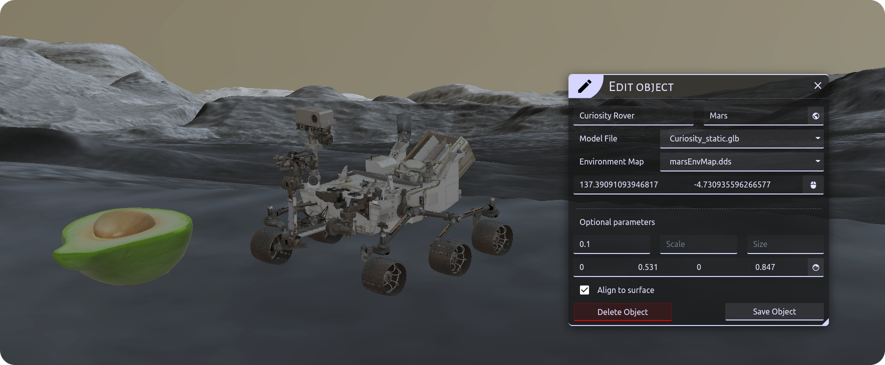

# Simple Objects for CosmoScout VR

A CosmoScout VR plugin to import glTF Models, place them and edit their configuration.





## Configuration 

Import all `.gltf` model files to /resources/models and your environment cube maps to /resources/textures.
The files will automatically be copied to the installation path, as you build and install CosmoScout VR.


Add a `csp-simple-objects` entry to the plugins in your `settings.json`. 
There you can specify all objects and their attributes.
Here is a short example describing possible attributes:

```
{
  "plugins": {
    ... [other plugins]
    "csp-simple-objects": {
      "objects": {
        "<unique name>": {
          "modelFile": "<relative path>",
          "environmentMap": "<relative path>",
          "anchor": "<SPICE center name>",
          "lngLat": [ <longitude>, <latitude> ],

          Optional parameters:
          "elevation": <float>,
          "scale": <float>,
          "diagonalLength": <float>,
          "rotation": [<x>, <y>, <z>, <w>],
          "alignToSurface": <boolean>
        },
        ... [more objects]
      }
    }
  }
}
```


## Example

To achieve the same result as in the demo image above, add this section to your plugins in the scene configuration.

```json
"csp-simple-objects": {
  "objects": {
    "Avocado": {
      "modelFile": "../share/resources/models/Avocado.glb",
      "environmentMap": "../share/resources/textures/marsEnvMap.dds",
      "anchor": "Mars",
      "lngLat": [
        137.39096509050674,
        -4.7309278444763345
      ],
      "elevation": 0.5,
      "scale": 40,
      "rotation": [
        0.5, 0.5, 0.5, -0.5
      ],
      "alignToSurface": true
    },
    "Curiosity Rover": {
      "modelFile": "../share/resources/models/Curiosity_static.glb",
      "environmentMap": "../share/resources/textures/marsEnvMap.dds",
      "anchor":"Mars",
      "lngLat": [
        137.39091093946817,
        -4.730935596266577
      ],
      "elevation": 0.1,
      "rotation": [
        0, 0.531, 0, 0.847
      ],
      "alignToSurface": true
    }
  }
}
``` 
